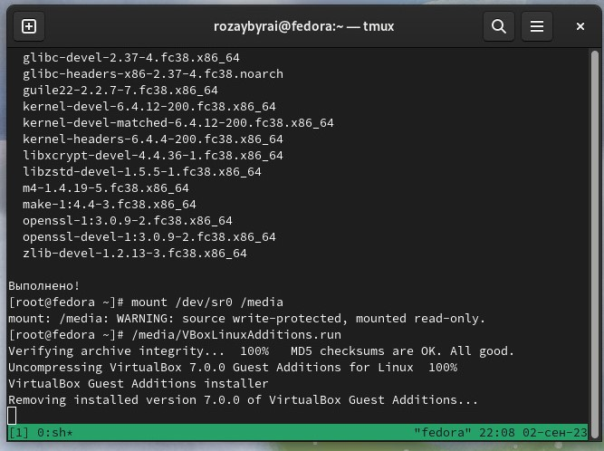

---
## Front matter
lang: ru-RU
title: "Установка ОС Linux на ВМ"
author: |
	Ыбырай Роза\inst{1}
	
institute: |
	\inst{1}RUDN University, Moscow, Russian Federation
	
date: 04 September, 2023, Moscow, Russia

## Formatting
toc: false
slide_level: 2
theme: metropolis
header-includes: 
 - \metroset{progressbar=frametitle,sectionpage=progressbar,numbering=fraction}
 - '\makeatletter'
 - '\beamer@ignorenonframefalse'
 - '\makeatother'
aspectratio: 43
section-titles: true
---

# Цели и задачи работы

## Цель лабораторной работы

- Приобретение практических навыков установки операционной системы на виртуальную машину

- Настройки минимально необходимых для дальнейшей работы сервисов.

## Задача лабораторной работы

- Создать виртуальную машину

- Установить ОС на ВМ

# Процесс выполнения лабораторной работы

## Процесс создания ВМ

1. Укажем имя и тип ОС виртуальной машины
{ #fig:001 width=50% }

2. Создаём новый виртуальный жесткий диск и задаём размер диска
{ #fig:002 width=50% }

3. Укажем размер основной памяти виртуальной машины — от 2048 МБ.
{ #fig:003 width=50% }

4. Итог
   
{ #fig:004 width=50% }

## Установка ОС

1. Установка языка
{ #fig:005 width=50% }

3. Региональные настройки система
{ #fig:006 width=50% }

4. Завершение установки
{ #fig:007 width=50% }

5. Установка имени и пароля для пользователя root
{ #fig:008 width=50% }

6. Установка дополнений гостевой ОС

{ #fig:009 width=50% }

## Обновления

1. Обновление всех пакетов

{ #fig:010 width=50% }

1. Установка драйверов для VirtualBox
    
{ #fig:011 width=50% }
{ #fig:012 width=50% }

3. Настройка раскладки клавиатуры

{ #fig:013 width=50% }

4. Установка имени пользователя и названия хоста

{ #fig:014 width=50% }
{ #fig:015 width=50% }

5. pandoc

{ #fig:016 width=50% }
{ #fig:017 width=50% }

6. texlive

{ #fig:018 width=50% }

# Выводы

Мы приобрели практические навыки установки операционных систем на виртуальную машину и настройки минимально необходимых для дальнейшей работы сервисов.

