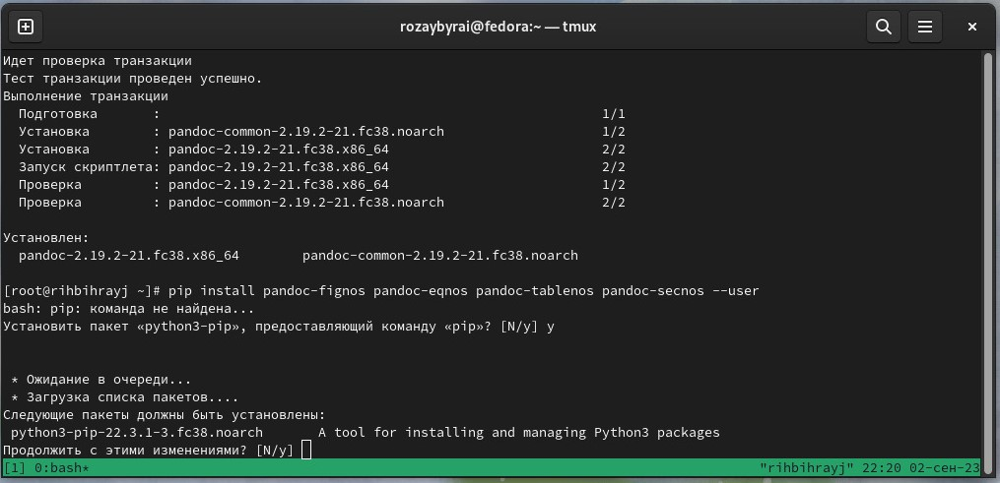
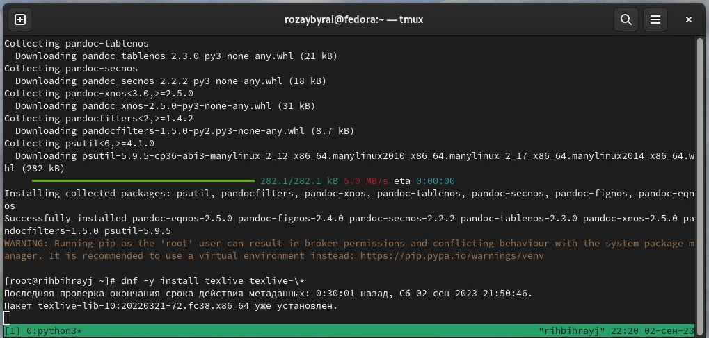

---
## Front matter
title: "Установка ОС Linux на виртуальную машину"
author: "Ыбырай Роза"

## Generic otions
lang: ru-RU
toc-title: "Содержание"

## Bibliography
bibliography: bib/cite.bib
csl: pandoc/csl/gost-r-7-0-5-2008-numeric.csl

## Pdf output format
toc: true # Table of contents
toc-depth: 2
lof: true # List of figures
lot: true # List of tables
fontsize: 12pt
linestretch: 1.5
papersize: a4
documentclass: scrreprt
## I18n polyglossia
polyglossia-lang:
  name: russian
  options:
	- spelling=modern
	- babelshorthands=true
polyglossia-otherlangs:
  name: english
## I18n babel
babel-lang: russian
babel-otherlangs: english
## Fonts
mainfont: PT Serif
romanfont: PT Serif
sansfont: PT Sans
monofont: PT Mono
mainfontoptions: Ligatures=TeX
romanfontoptions: Ligatures=TeX
sansfontoptions: Ligatures=TeX,Scale=MatchLowercase
monofontoptions: Scale=MatchLowercase,Scale=0.9
## Biblatex
biblatex: true
biblio-style: "gost-numeric"
biblatexoptions:
  - parentracker=true
  - backend=biber
  - hyperref=auto
  - language=auto
  - autolang=other*
  - citestyle=gost-numeric
## Pandoc-crossref LaTeX customization
figureTitle: "Рис."
tableTitle: "Таблица"
listingTitle: "Листинг"
lofTitle: "Список иллюстраций"
lotTitle: "Список таблиц"
lolTitle: "Листинги"
## Misc options
indent: true
header-includes:
  - \usepackage{indentfirst}
  - \usepackage{float} # keep figures where there are in the text
  - \floatplacement{figure}{H} # keep figures where there are in the text
---

# Цель работы

Целью данной работы является приобретение практических навыков установки операционной системы на виртуальную машину, настройки минимально необходимых для дальнейшей работы сервисов.

# Задание

Создать виртуальную машину и на ней установить операционную систему.

# Выполнение лабораторной работы
## Процесс создания виртуальной машины
1. Укажем имя и тип ОС виртуальной машины
{ #fig:001 width=50% }

2. Создаём новый виртуальный жесткий диск и задаём размер диска
{ #fig:002 width=50% }

3. Укажем размер основной памяти виртуальной машины — от 2048 МБ.
{ #fig:003 width=50% }

4. Итог
   
{ #fig:004 width=50% }

### Установка ОС

5. Установка языка
{ #fig:005 width=50% }

6. Региональные настройки система
{ #fig:006 width=50% }

7. Завершение установки
{ #fig:007 width=50% }

8. Установка имени и пароля для пользователя root
{ #fig:008 width=50% }

9. Установка дополнений гостевой ОС

{ #fig:009 width=50% }

#### Обновления

10. Обновление всех пакетов

{ #fig:010 width=50% }

11. Установка драйверов для VirtualBox
    
{ #fig:011 width=50% }
{ #fig:012 width=50% }

12. Настройка раскладки клавиатуры

{ #fig:013 width=50% }

13. Установка имени пользователя и названия хоста

{ #fig:014 width=50% }
{ #fig:015 width=50% }

14. pandoc

{ #fig:016 width=50% }
{ #fig:017 width=50% }

15. texlive

{ #fig:018 width=50% }

# Выводы

Мы приобрели практические навыки установки операционных систем на виртуальную машину и настройки минимально необходимых для дальнейшей работы сервисов.

