---
## Front matter
lang: ru-RU
title: первоначальна настройка git
author: |
	 Ыбырай Роза\inst{1}
	
institute: \inst{1}RUDN University, Moscow, Russian Federation
	
date: 4th september,2023,Moscow, Russia

## Formatting
toc: false
slide_level: 2
theme: metropolis
header-includes: 
 - \metroset{progressbar=frametitle,sectionpage=progressbar,numbering=fraction}
 - '\makeatletter'
 - '\beamer@ignorenonframefalse'
 - '\makeatother'
aspectratio: 43
section-titles: true
---

# Цель лабораторной работы

	- Изучить идеологию и применение средств контроля версий.
	- Освоить умения по работе с git.

## Задание

	- Создать базовую конфигурацию для работы с git.
	- Создать ключ SSH.
	- Создать ключ PGP.
	- Настроить подписи git.
	- Зарегистрироваться на Github.
	- Создать локальный каталог для выполнения заданий по предмету.

# Выполнение лабораторной работы

## Установка программного обеспечения

1. Установка git и gh

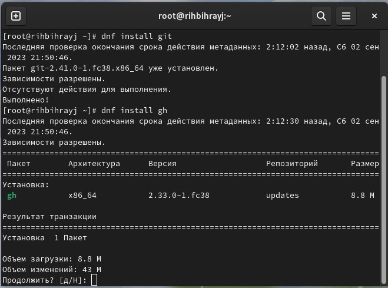{ #fig:001 width=50%}

## Базовая настройка git

1. Зададим имя и email владельца репозитория:
2. Настроим utf-8 в выводе сообщений git:
3.Настройте верификацию и подписание коммитов git (см. Верификация коммитов git с помощью GPG).
  Зададим имя начальной ветки (будем называть её master):
4. Параметр autocrlf:
5. Параметр safecrlf:

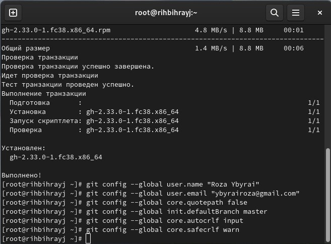{ #fig:002 width=50%}

## Создание ключи ssh и pgp

1. по алгоритму rsa с ключём размером 4096 бит:
2. по алгоритму ed25519:
3. Генерируем ключ
4. Из предложенных опций выбираем:
	- тип RSA and RSA;
	- размер 4096;
	- выберите срок действия; значение по умолчанию — 0 (срок действия не истекает никогда).
5. GPG запросит личную информацию, которая сохранится в ключе:
	- Имя (не менее 5 символов).
	- Адрес электронной почты.
	- При вводе email убедитесь, что он соответствует адресу, используемому на GitHub.
	- Комментарий. Можно ввести что угодно или нажать клавишу ввода, чтобы оставить это поле пустым.

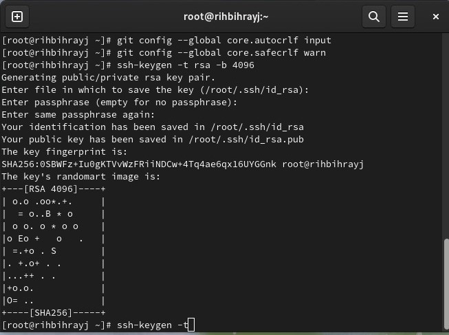{ #fig:003 width=50%}
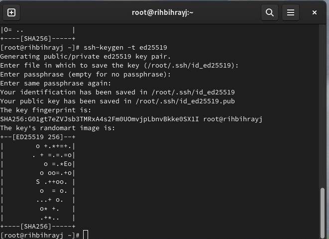{ #fig:004 width=50%}

## Добавление PGP ключа в GitHub

1. Выводим список ключей и копируем отпечаток приватного ключа:
2. Cкопируйте ваш сгенерированный PGP ключ в буфер обмена:
3. Перейдите в настройки GitHub (https://github.com/settings/keys), нажмите на кнопку New GPG key и вставьте полученный ключ в поле ввода.

{ #fig:005 width=50%}
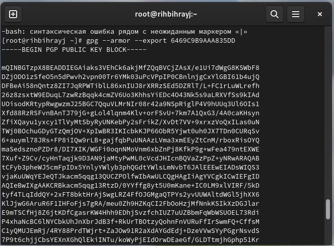{ #fig:006 width=50%}
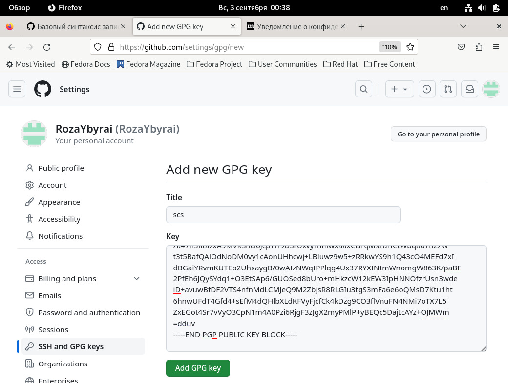{ #fig:007 width=50%}
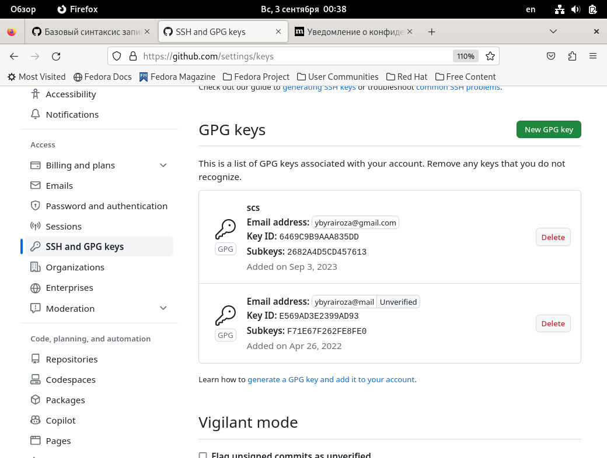{ #fig:008 width=50%}

## Настройка автоматических подписей коммитов git

Используя введёный email, укажите Git применять его при подписи коммитов:

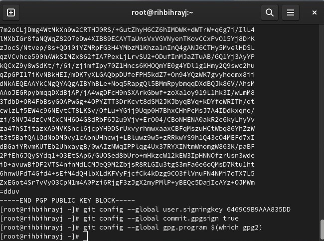{ #fig:009 width=50%}

## Настройка gh

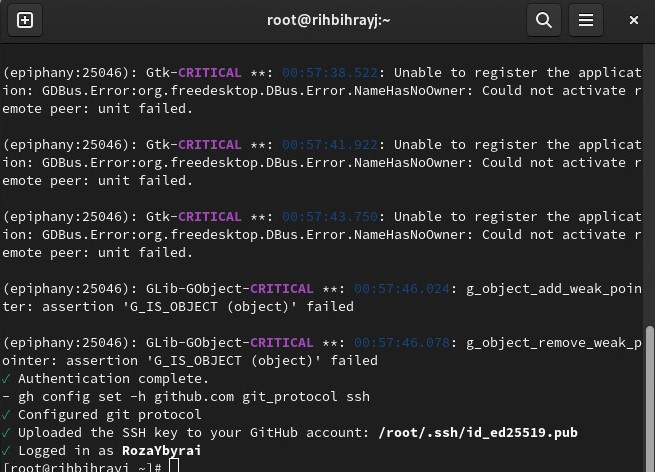{ #fig:010 width=50%}

## Шаблон для рабочего пространства

### Сознание репозитория курса на основе шаблона

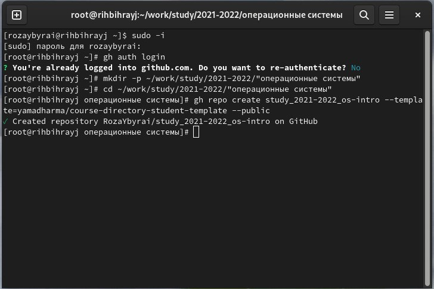{ #fig:011 width=50%}
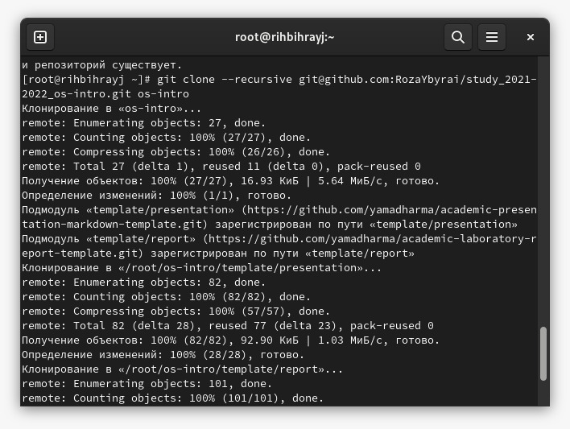{ #fig:012 width=50%}

### Настройка каталога курса

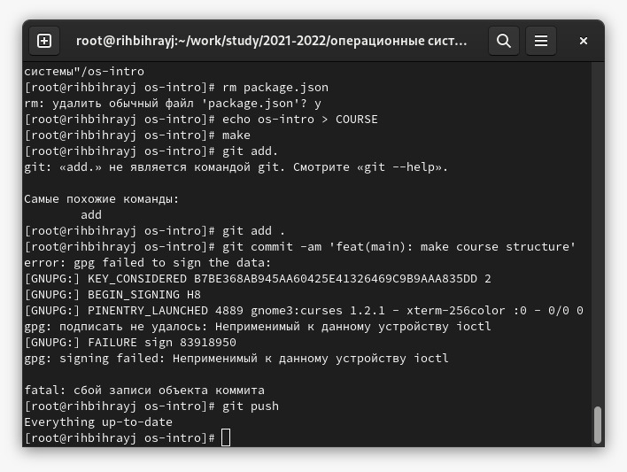{ #fig:013 width=50%}

# Выводы

Мы приобрели практические навыки работы с git.

