---
## Front matter
lang: ru-RU
title: Markdown
author: |
	Ыбырай Роза\inst{1}
institute: |
	\inst{1}ФФМиЕН,РУДН,Москва,РФ
date: 4 сентября,2023.

## Formatting
toc: false
slide_level: 2
theme: metropolis
header-includes: 
 - \metroset{progressbar=frametitle,sectionpage=progressbar,numbering=fraction}
 - '\makeatletter'
 - '\beamer@ignorenonframefalse'
 - '\makeatother'
aspectratio: 43
section-titles: true
---

# Цель лабораторной работы

Научиться оформлять отчёты с помощью легковесного языка разметки Markdown.

# Выполнение лабораторной работы
## Базовые сведения о Markdown

### 1. Чтобы создать заголовок, используйте знак ( # ), например:
 
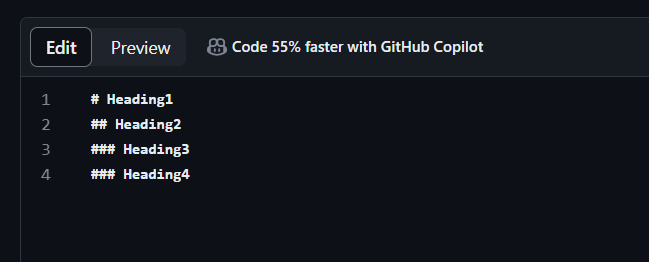{ #fig:001 width=40%}
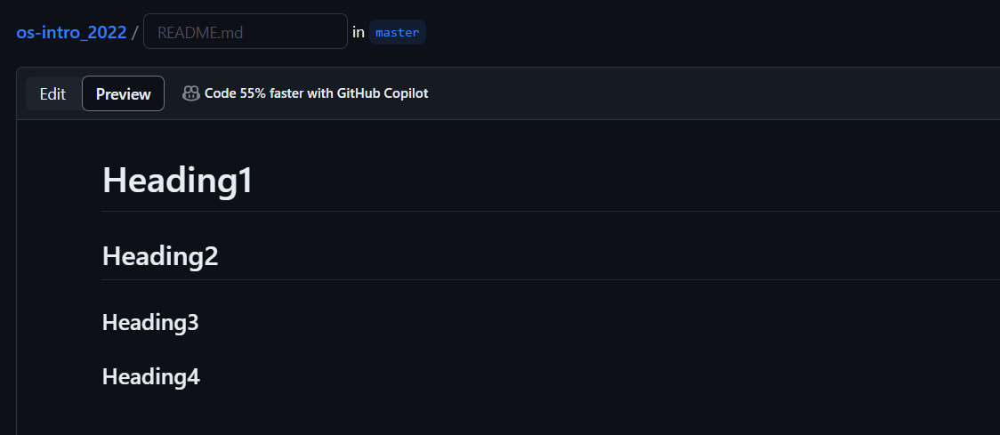{ #fig:002 width=40%}

### 2. Чтобы задать для текста полужирное начертание, заключите его в двойные звездочки:
   
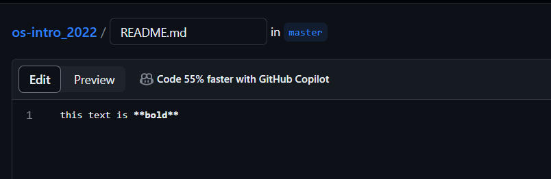{ #fig:003 width=40%}
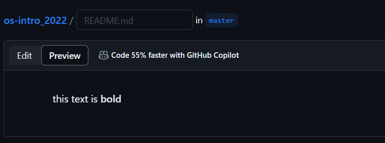{ #fig:004 width=40%}

### 3. Чтобы задать для текста курсивное начертание, заключите его в одинарные звездочки:

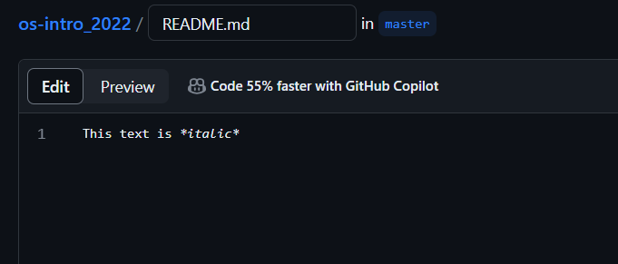{ #fig:005 width=40%}
{ #fig:006 width=40%}

### 4. Чтобы задать для текста полужирное и курсивное начертание, заключите его в тройные
звездочки:

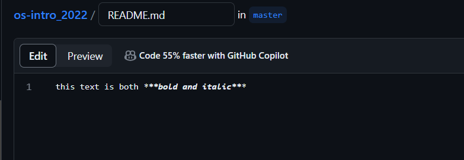{ #fig:007 width=40%}
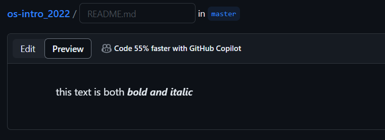{ #fig:008 width=40%}

### 5. Блоки цитирования создаются с помощью символа >:

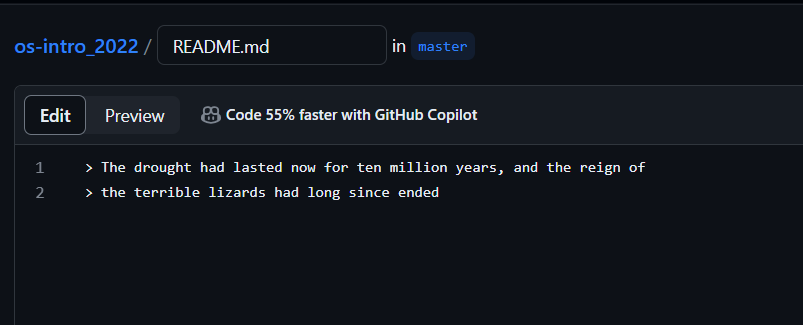{ #fig:009 width=40%}
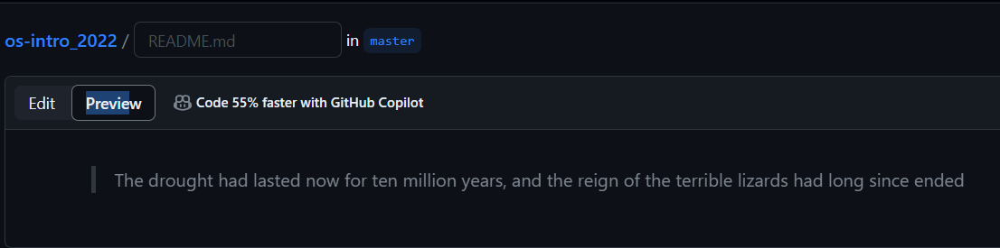{ #fig:010 width=40%}

### 6. Неупорядоченный (маркированный) список можно отформатировать с помощью звездочек или тире:

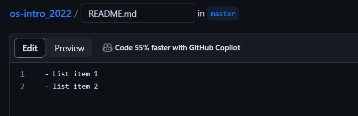{ #fig:011 width=40%}
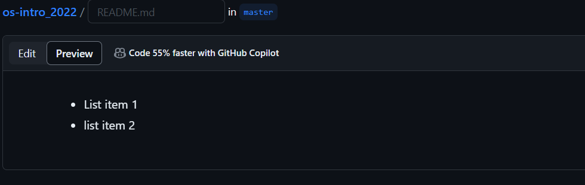{ #fig:012 width=40%}

### 7. Чтобы вложить один список в другой, добавьте отступ для элементов дочернего списка:

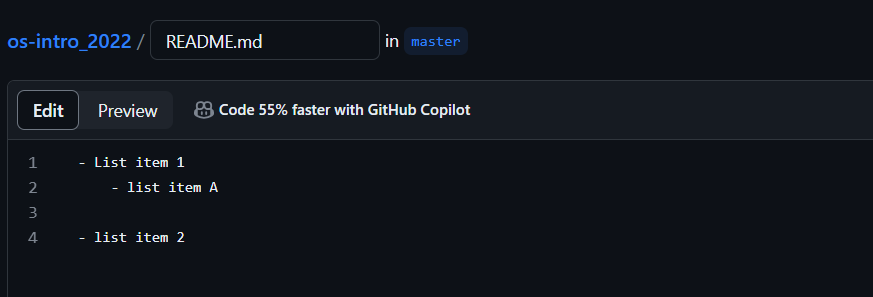{ #fig:013 width=40%}
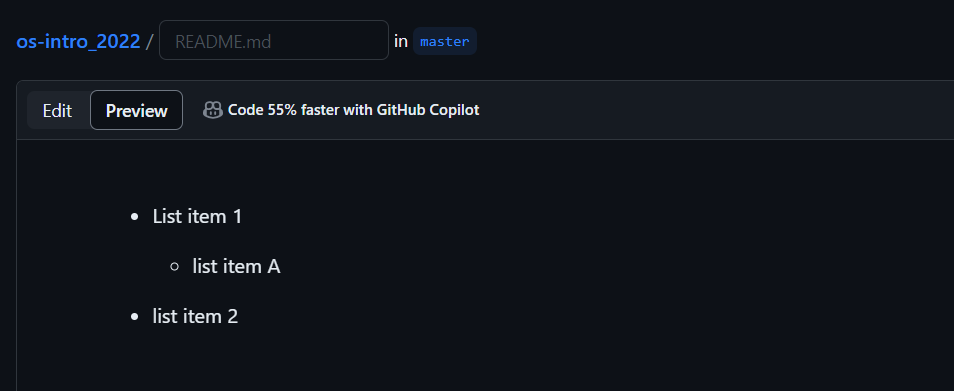{ #fig:014 width=40%}

### 8. Упорядоченный список можно отформатировать с помощью соответствующих цифр:

{ #fig:015 width=40%}
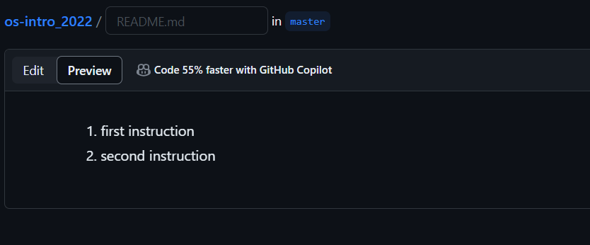{ #fig:016 width=40%}

### 9. Чтобы вложить один список в другой, добавьте отступ для элементов дочернего списка:

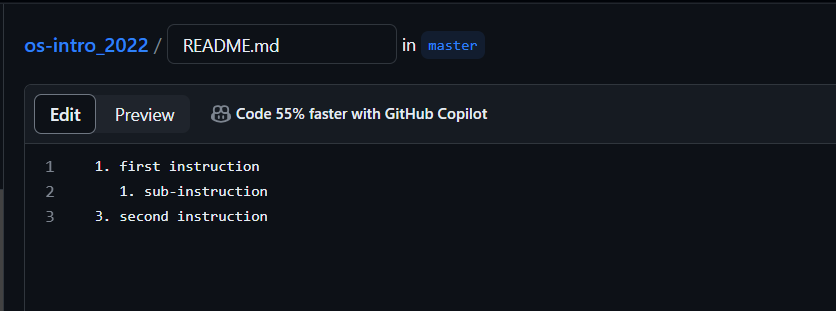{ #fig:017 width=40%}
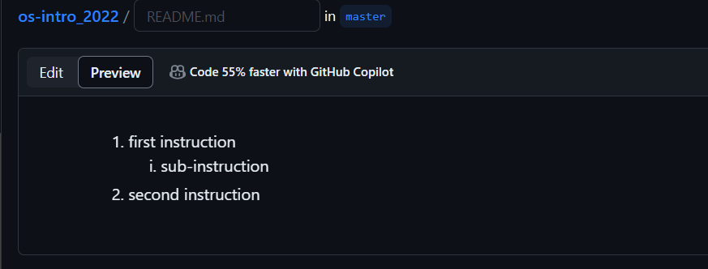{ #fig:018 width=40%}

### 10. Синтаксис Markdown для встроенной ссылки состоит из части [link text] , представляющей текст гиперссылки, и части (file-name.md) – URL-адреса или имени файла,
на который дается ссылка:

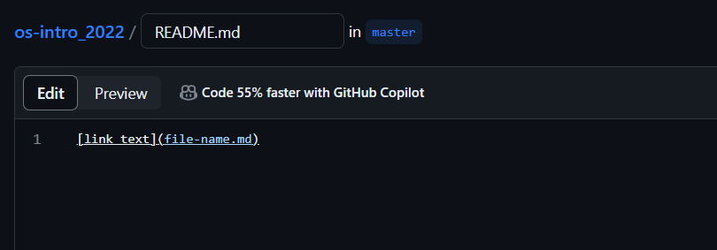{ #fig:019 width=40%}
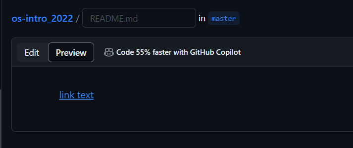{ #fig:020 width=40%}

### 11. Markdown поддерживает как встраивание фрагментов кода в предложение, так и их
размещение между предложениями в виде отдельных огражденных блоков. Огражденные
блоки кода — это простой способ выделить синтаксис для фрагментов кода. Общий
формат огражденных блоков кода:

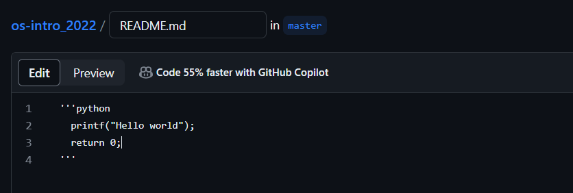{ #fig:021 width=40%}
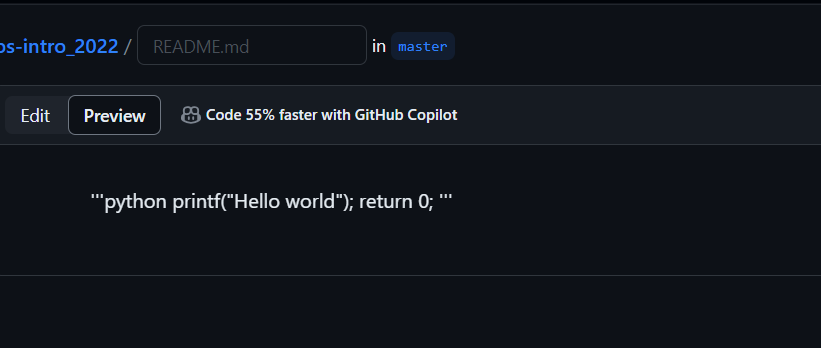{ #fig:022 width=40%}

### 12. Верхние и нижние индексы, внутритекстовые формулы делаются аналогично формулам LaTeX.:

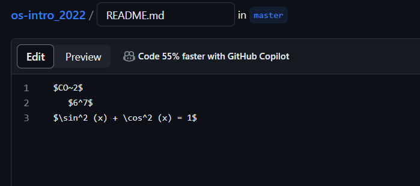{ #fig:023 width=40%}
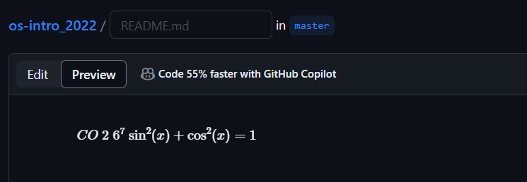{ #fig:024 width=40%}

### 13. Выключные формулы:
sin2
(𝑥) + cos2
(𝑥) = 1
{#eq:eq:sin2+cos2} со ссылкой в тексте «Смотри формулу ([-@eq:eq:sin2+cos2]).» записывается как

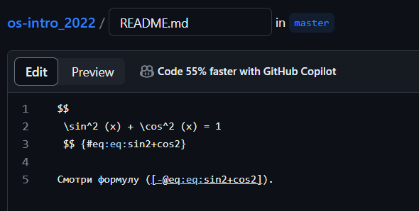{ #fig:025 width=40%}
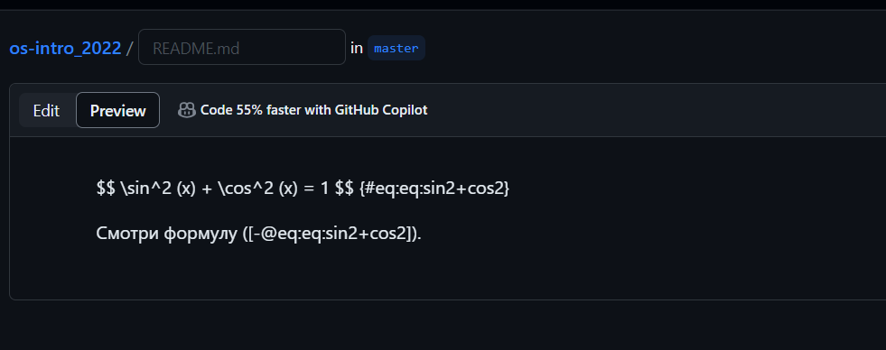{ #fig:026 width=40%}

# Выводы

Учили базовые сведения о Markdown

