---
## Front matter
lang: ru-RU
title: Основы интерфейса взаимодействия пользователя с системой Unix на уровне командной строки
author: |
	Ыбырай Роза\inst{1}
	
institute: |
	\inst{1}RUDN University, Moscow, Russian Federation
date: 5 сентября, 2023, Москва

## Formatting
toc: false
slide_level: 2
theme: metropolis
header-includes: 
 - \metroset{progressbar=frametitle,sectionpage=progressbar,numbering=fraction}
 - '\makeatletter'
 - '\beamer@ignorenonframefalse'
 - '\makeatother'
aspectratio: 43
section-titles: true
---

# Цель работы

Приобретение практических навыков взаимодействия пользователя с системой посредством командной строки.

# Выполнение лабораторной работы

## 1. Определить полное имя домашнего каталога.

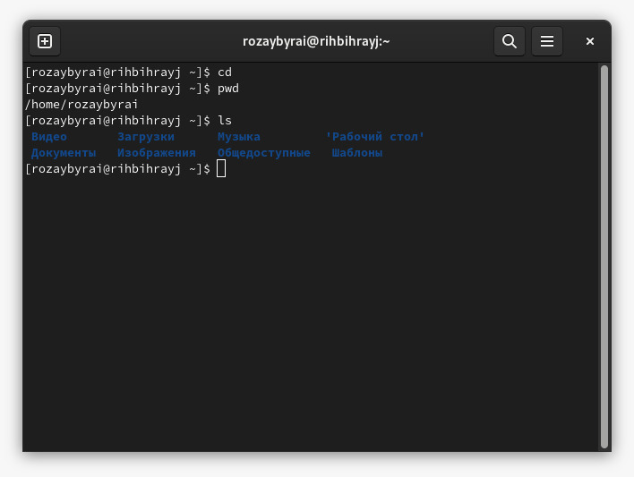{ #fig:001 width=70% }

## 2. Выполнение следующих действий:
1. Переход в каталог /tmp.

	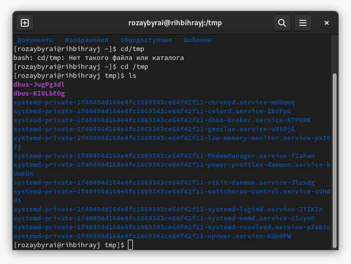{ #fig:002 width=70% }

2. Выведение на экран содержимое каталога /tmp. Для этого использовали команду ls
           с различными опциями. 

	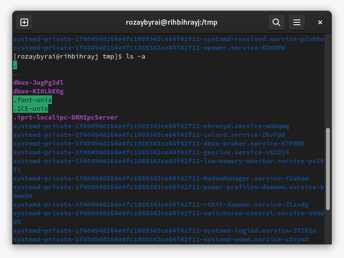{ #fig:003 width=70% }
	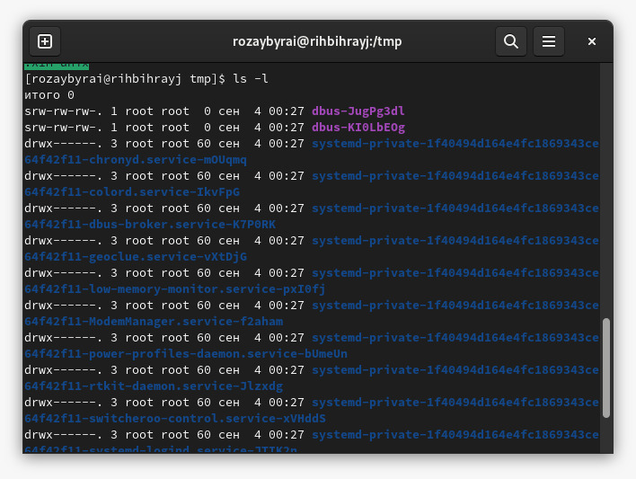{ #fig:004 width=70% }
	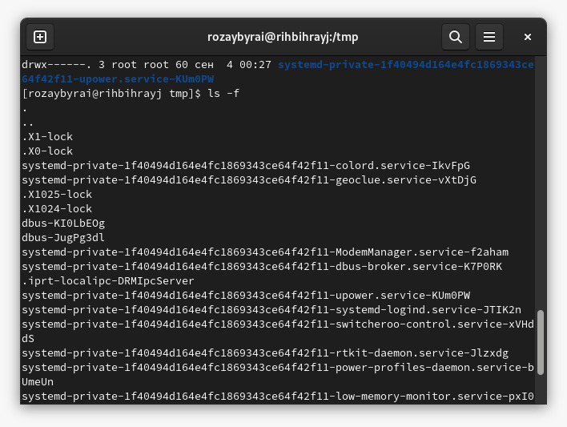{ #fig:005 width=70% }

3. Определите, есть ли в каталоге /var/spool подкаталог с именем cron? Нет.
    
   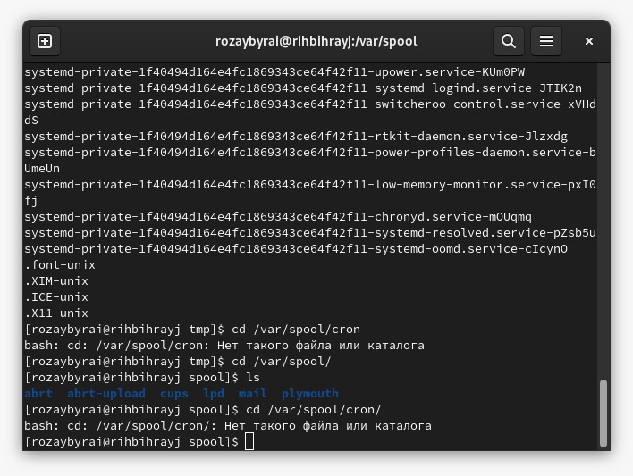{ #fig:006 width=70% }
    
4. Перейдите в Ваш домашний каталог и выведите на экран его содержимое. Определите, кто является владельцем файлов и подкаталогов?
 
	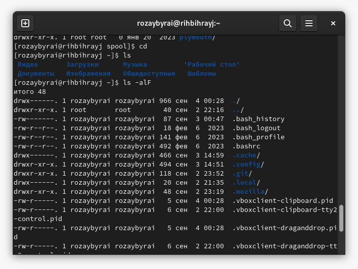{ #fig:008 width=70% }
	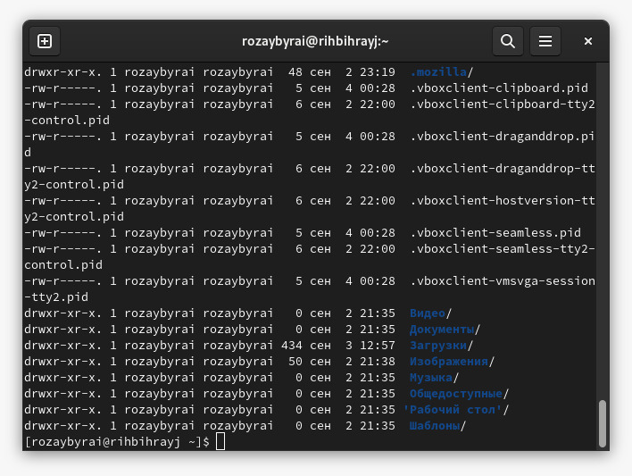{ #fig:009 width=70% }

## 3. Выполнение следующих действий:
В домашнем каталоге создаем новый каталог с именем newdir. В каталоге ~/newdir создаем новый каталог с именем morefun.
    В домашнем каталоге создаем одной командой три новых каталога с именами letters, memos, misk. Затем удалите эти каталоги одной командой. Попробуем удалить ранее созданный каталог ~/newdir командой rm. Проверим,
	был ли каталог удалён. Удалим каталог ~/newdir/morefun из домашнего каталога. Проверим, был ли каталог удалён.

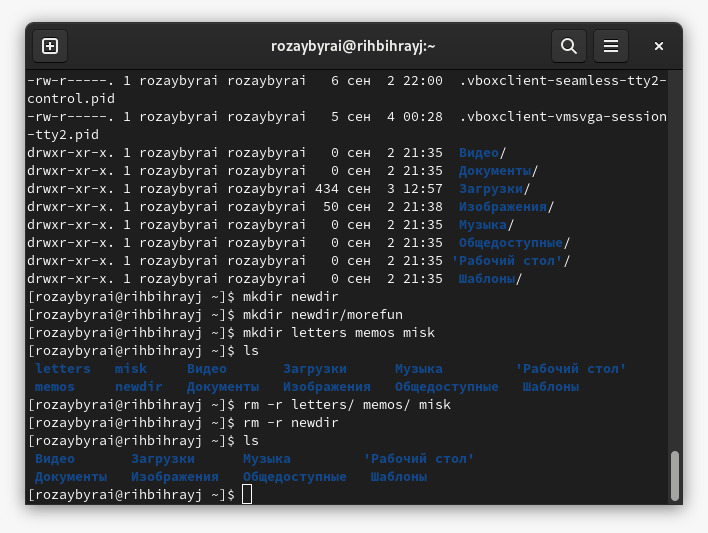{ #fig:010 width=70% }
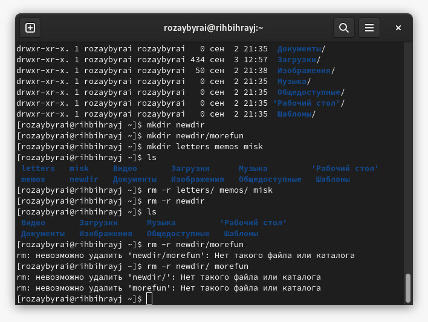{ #fig:011 width=70% }

## 4. . С помощью команды man определим, какую опцию команды ls нужно использовать для просмотра содержимое не только указанного каталога, но и подкаталогов,
входящих в него.

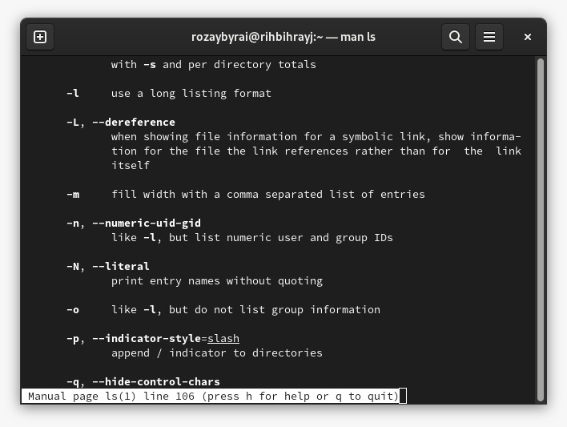{ #fig:013 width=70% }

## 5. С помощью команды man определили набор опций команды ls, позволяющий отсортировать по времени последнего изменения выводимый список содержимого каталога
с развёрнутым описанием файлов.

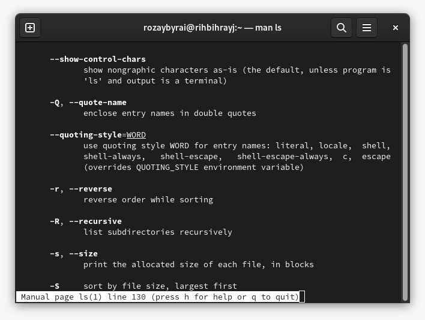{ #fig:014 width=70% }

## 6. . Используя команду man для просмотра описания следующих команд: cd, pwd, mkdir,
rmdir, rm. Пояснили основные опции этих команд.

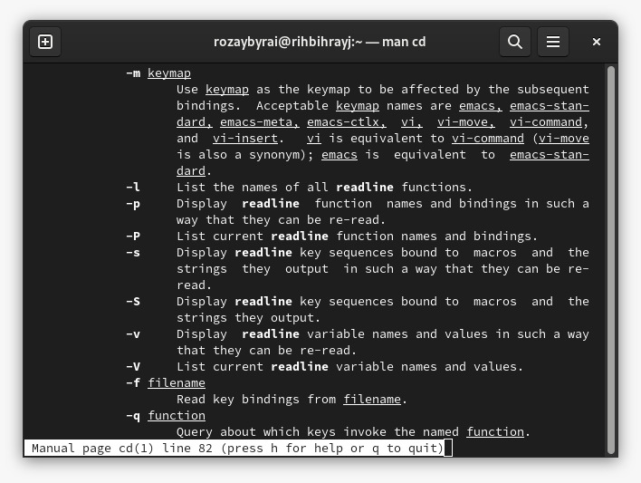{ #fig:015 width=70% }
	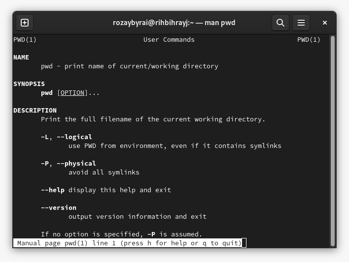{ #fig:016 width=70% }
	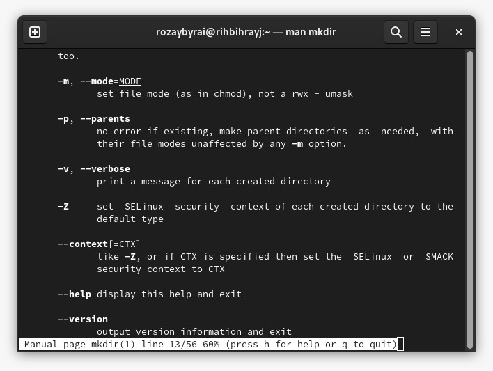{ #fig:017 width=70% }
	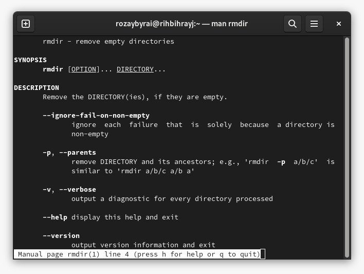{ #fig:018 width=70% }
	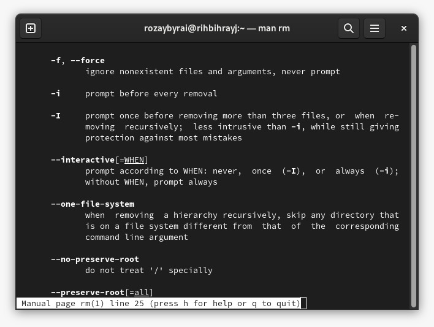{ #fig:019 width=70% }

## 7. Используя информацию, полученную при помощи команды history, выполнили модификацию и исполнение нескольких команд из буфера команд.
   
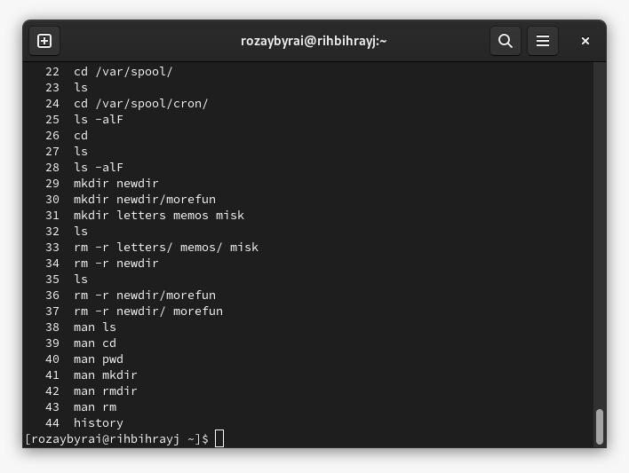{ #fig:020 width=70% }

# Выводы

Мы приобрели практические навыки взаимодействия пользователя с системой посредством командной строки.

## {.standout}

Wer's nicht glaubt, bezahlt einen Taler
