---
## Front matter
lang: ru-RU
title:  Анализ файловой системы Linux. Команды для работы с файлами и каталогами
author: |
	Anton L. Sevastianov\inst{1}
institute: |
	\inst{1}RUDN University, Moscow, Russian Federation
date: 5 сентября, 2023, Москва

## Formatting
toc: false
slide_level: 2
theme: metropolis
header-includes: 
 - \metroset{progressbar=frametitle,sectionpage=progressbar,numbering=fraction}
 - '\makeatletter'
 - '\beamer@ignorenonframefalse'
 - '\makeatother'
aspectratio: 43
section-titles: true
---

# Цель работы

Ознакомление с файловой системой Linux, её структурой, именами и содержанием каталогов. Приобретение практических навыков по применению команд для работы
с файлами и каталогами, по управлению процессами (и работами), по проверке использования диска и обслуживанию файловой системы.

# Выполнение лабораторной работы

## Выполнение всех пример, приведённых в первой части описания лабораторной работы
1. Копирование файлов и каталогов
 
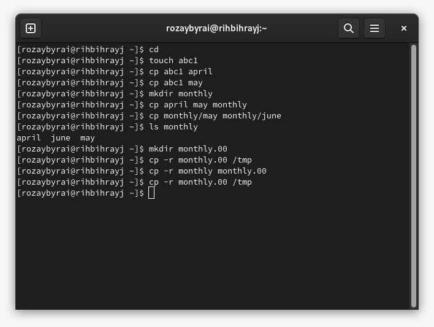{ #fig:001 width=70% }

2. Перемещение и переименование файлов и каталогов

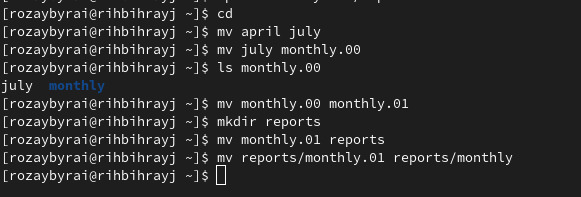{ #fig:002 width=70% }

3. Права доступа

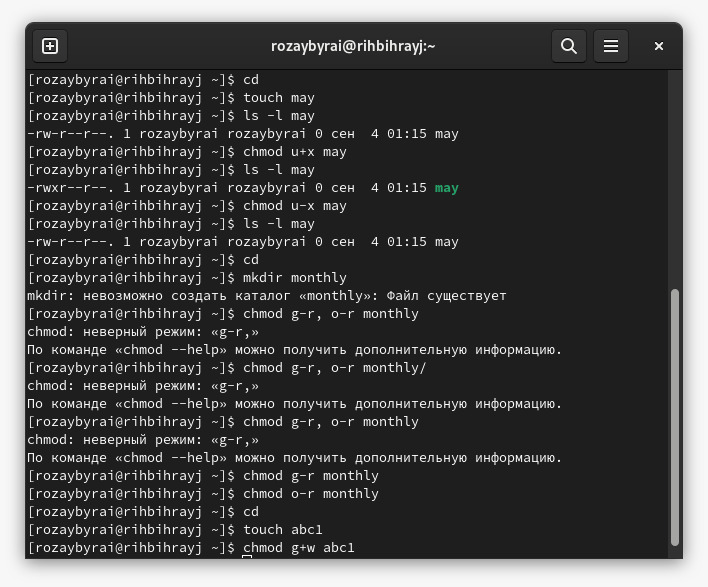{ #fig:003 width=70% }
## Выполнение следующих действий

1. Скопирование файла /usr/include/sys/io.h в домашний каталог и назовим его equipment. Если файла io.h нет, то используем любой другой файл в каталоге
/usr/include/sys/ вместо него. В домашнем каталоге создаем директорию ~/ski.plases. Переместим файл equipment в каталог ~/ski.plases.
Переименуем файл ~/ski.plases/equipment в ~/ski.plases/equiplist. Создаем в домашнем каталоге файл abc1 и скопируйте его в каталог
~/ski.plases, назовем его equiplist2. Создаем каталог с именем equipment в каталоге ~/ski.plases. Переместим файлы ~/ski.plases/equiplist и equiplist2 в каталог ~/ski.plases/equipment. Создаем и переместите каталог ~/newdir в каталог ~/ski.plases и назовите его plans.

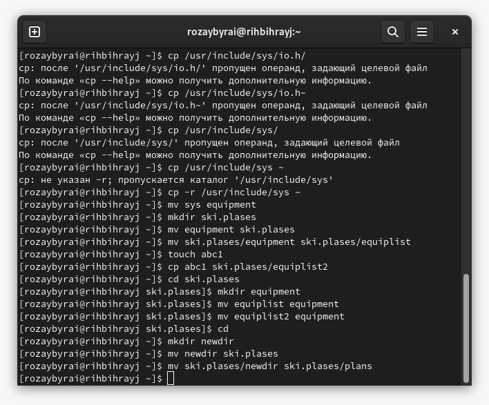{ #fig:004 width=70% }

 2. Определим опции команды chmod, необходимые для того, чтобы присвоить перечисленным ниже файлам выделенные права доступа, считая, что в начале таких прав
нет:
	- drwxr--r-- ... australia
	- drwx--x--x ... play
	- -r-xr--r-- ... my_os
	- -rw-rw-r-- ... feathers

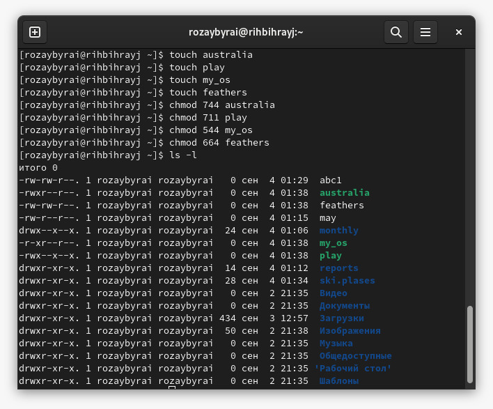{ #fig:005 width=70% }

3.
	- Просмотрим содержимое файла /etc/password.
	- Скопируем файл ~/feathers в файл ~/file.old.
	- Переместим файл ~/file.old в каталог ~/play.
	- Скопируем каталог ~/play в каталог ~/fun.
	- Переместим каталог ~/fun в каталог ~/play и назовите его games.
	- Лишим владельца файла ~/feathers права на чтение.
	- Что произойдёт, если вы попытаетесь просмотреть файл ~/feathers командой cat? Отказано в доступе.
	- Что произойдёт, если вы попытаетесь скопировать файл ~/feathers? Отказано в доступе.
	- Даем владельцу файла ~/feathers право на чтение.
	- Лишим владельца каталога ~/play права на выполнение.
	- Перейдем в каталог ~/play. Что произошло?
	- Даем владельцу каталога ~/play право на выполнение.

 	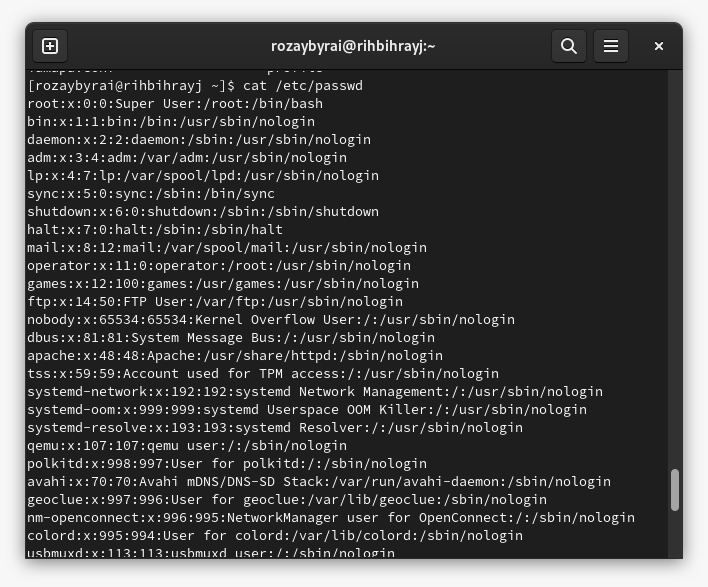{ #fig:006 width=70% }
	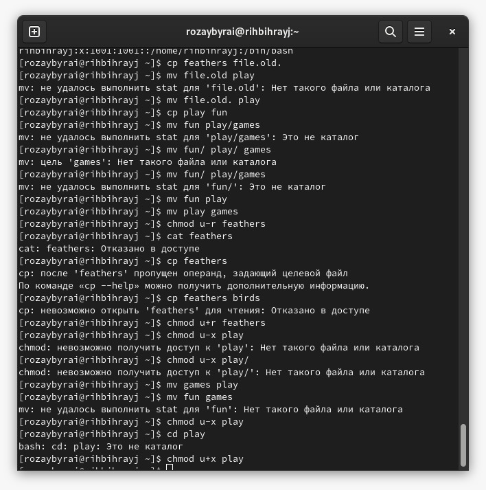{ #fig:007 width=70% }
	
4. Прочтение man по командам mount, fsck, mkfs, kill
   	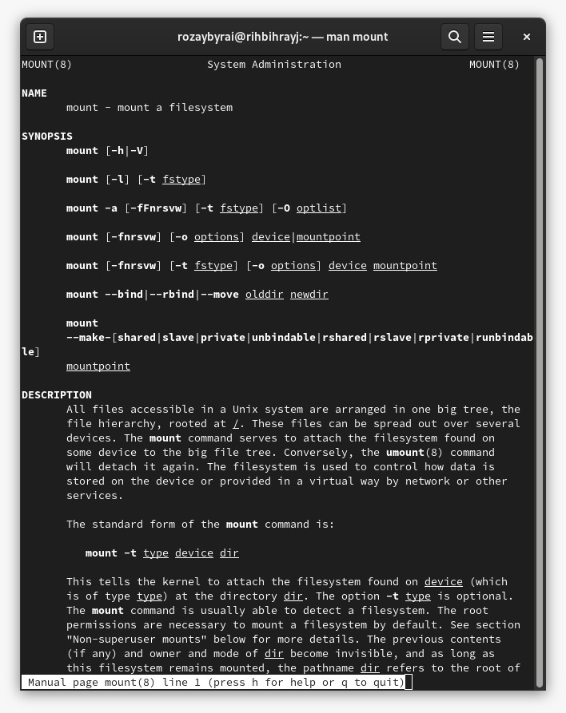{ #fig:008 width=70% }
	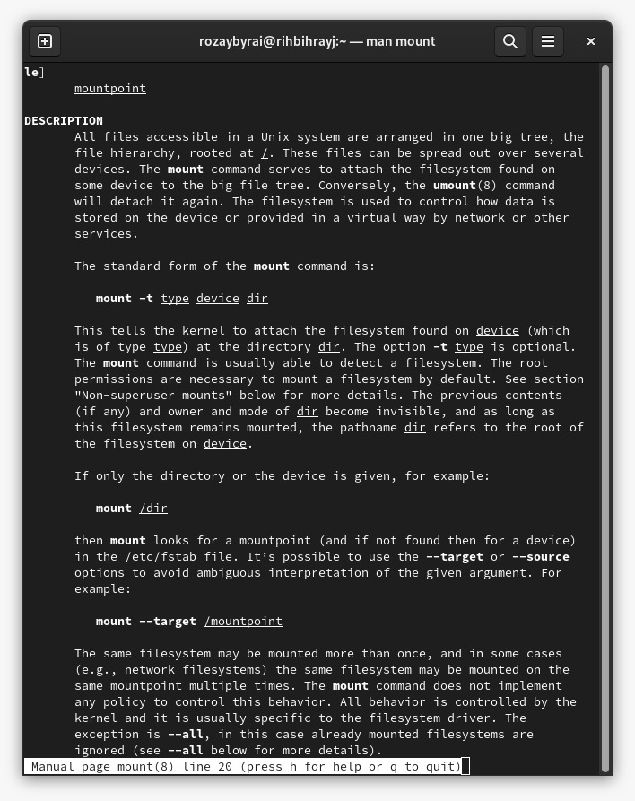{ #fig:009 width=70% }
	{ #fig:010 width=70% }
	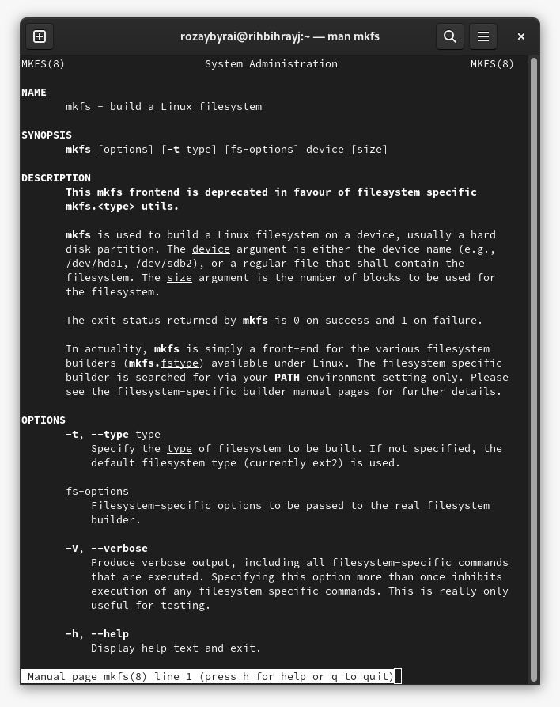{ #fig:011 width=70% }
	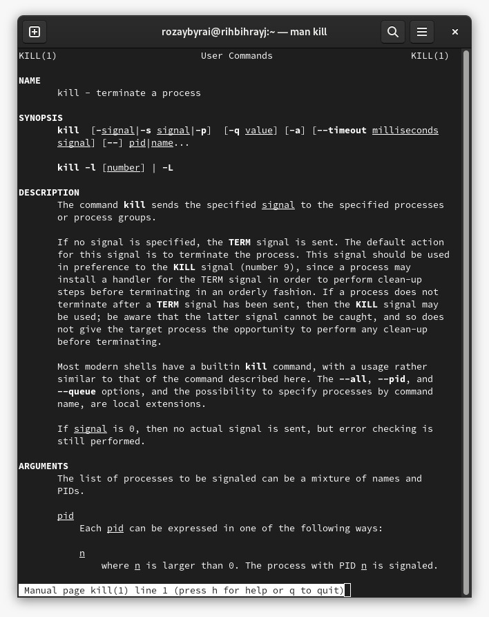{ #fig:012 width=70% }
# Выводы

В ходе выполнения данной работы мы ознакомились с файловой системой Linux, её структурой, именами и содержанием каталогов. Приобрели практические навыки по применению команд для работы с файлами и каталогами, по управлению процессами (и работами), по проверке использования диска и обслуживанию файловой системы.
## {.standout}

Wer's nicht glaubt, bezahlt einen Taler
