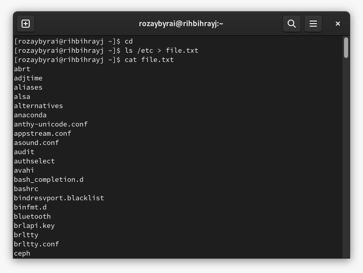
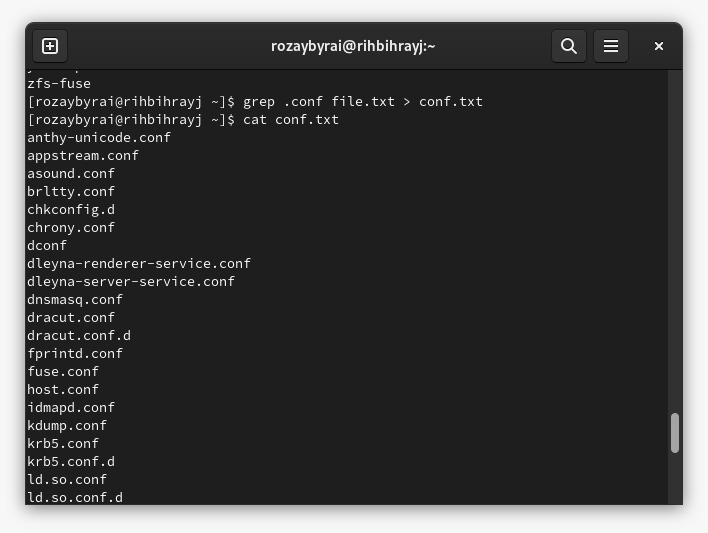
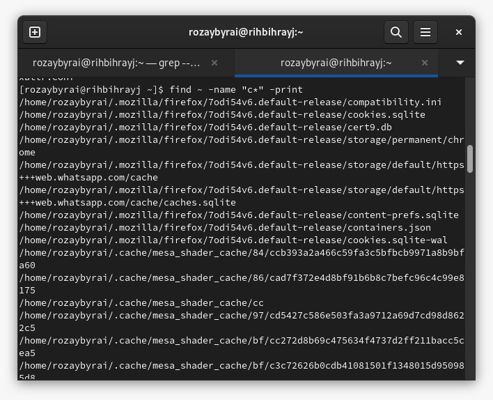
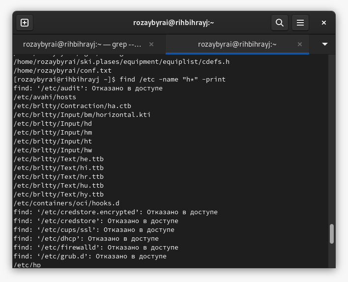
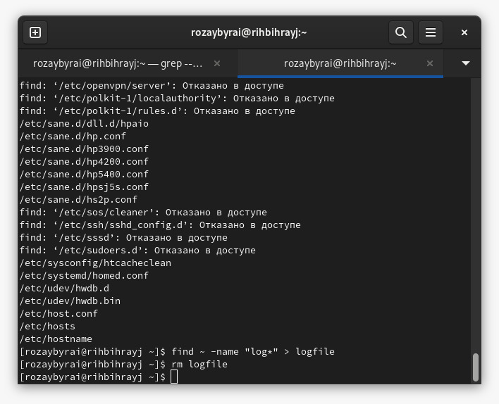
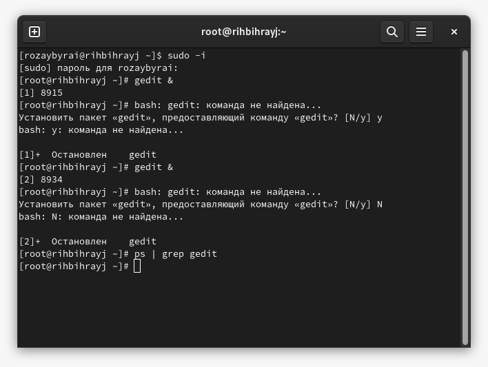
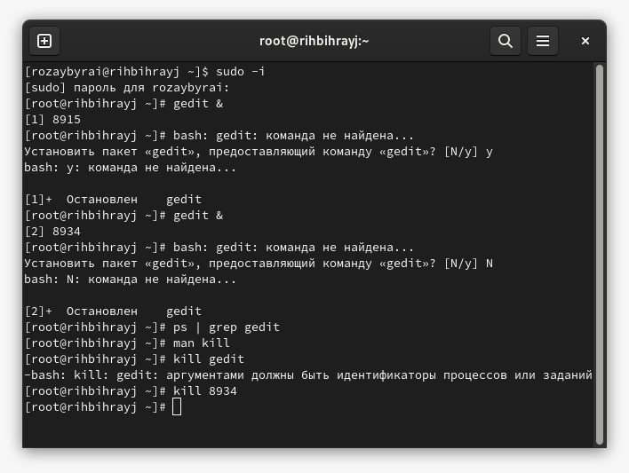
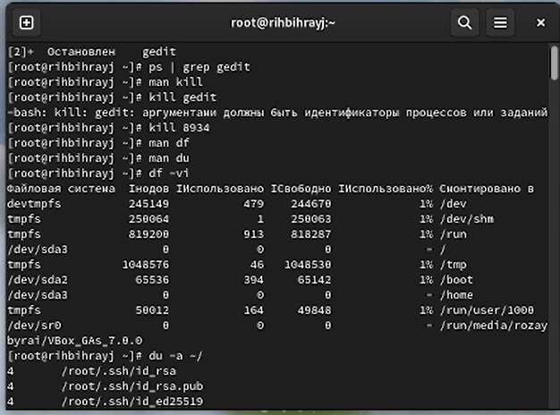
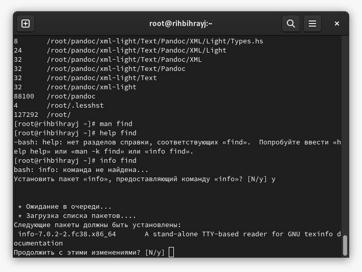
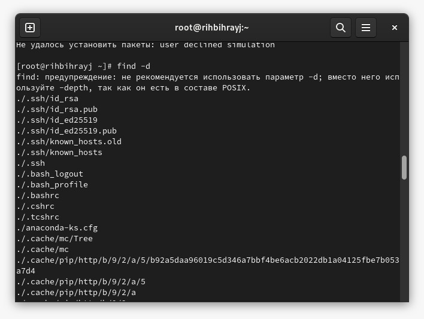

---
## Front matter
lang: ru-RU
title: Поиск файлов. Перенаправление ввода-вывода. Просмотр запущенных процессов
author: |
	Ыбырай Роза\inst{1}
institute: |
	\inst{1}RUDN University, Moscow, Russian Federation
date: 5 сентября, 2023, Москва

## Formatting
toc: false
slide_level: 2
theme: metropolis
header-includes: 
 - \metroset{progressbar=frametitle,sectionpage=progressbar,numbering=fraction}
 - '\makeatletter'
 - '\beamer@ignorenonframefalse'
 - '\makeatother'
aspectratio: 43
section-titles: true
---

# Цель работы

Ознакомление с инструментами поиска файлов и фильтрации текстовых данных.
Приобретение практических навыков: по управлению процессами (и заданиями), по
проверке использования диска и обслуживанию файловых систем.

# Задание

1. Изучить перенаправление ввода вывода.
2. Изучить работу фильтров и команду поиска.
3. Ознакомиться с управлением процессами и их получение.
4. Ознакомиться с командами df du.

# Выполнение лабораторной работы

### 1. Осуществили вход в систему, используя соответствующее имя пользователя. Записали в файл file.txt названия файлов, содержащихся в каталоге /etc. Допишите в этот же файл названия файлов, содержащихся в вашем домашнем каталоге.

{ #fig:001 width=70% }

### 2. Выведили имена всех файлов из file.txt, имеющих расширение .conf, после чего запишите их в новый текстовой файл conf.txt.

{ #fig:002 width=70% }

### 3. Определили, какие файлы в вашем домашнем каталоге имеют имена, начинавшиеся с символа c

{ #fig:003 width=70% }

### 4. Выведили на экран (по странично) имена файлов из каталога /etc, начинающиеся с символа h

{ #fig:004 width=70% }

### 5. Запустили в фоновом режиме процесс, который будет записывать в файл ~/logfile файлы, имена которых начинаются с log. Удалили файл ~/logfile.

{ #fig:005 width=70% }

### 6. Запустили из консоли в фоновом режиме редактор gedit. Определите идентификатор процесса gedit, используя команду ps, конвейер и фильтр grep.

{ #fig:006 width=70% }

### 7. Прочитали справку (man) команды kill, после чего используйте её для завершения процесса gedit

{ #fig:007 width=70% }

### 8. Выполнили команды df и du, предварительно получив более подробную информацию об этих командах, с помощью команды man.

{ #fig:008 width=70% }

### 9. Воспользовавшись справкой команды find, выведите имена всех директорий, имеющихся в вашем домашнем каталоге.

{ #fig:009 width=70% }
{ #fig:010 width=70% }

# Выводы

Ознакомились с инструментами поиска файлов и фильтрации текстовых данных. Приобретели практические навыки: по управлению процессами (и заданиями), по
проверке использования диска и обслуживанию файловых систем.

## {.standout}

Wer's nicht glaubt, bezahlt einen Taler
