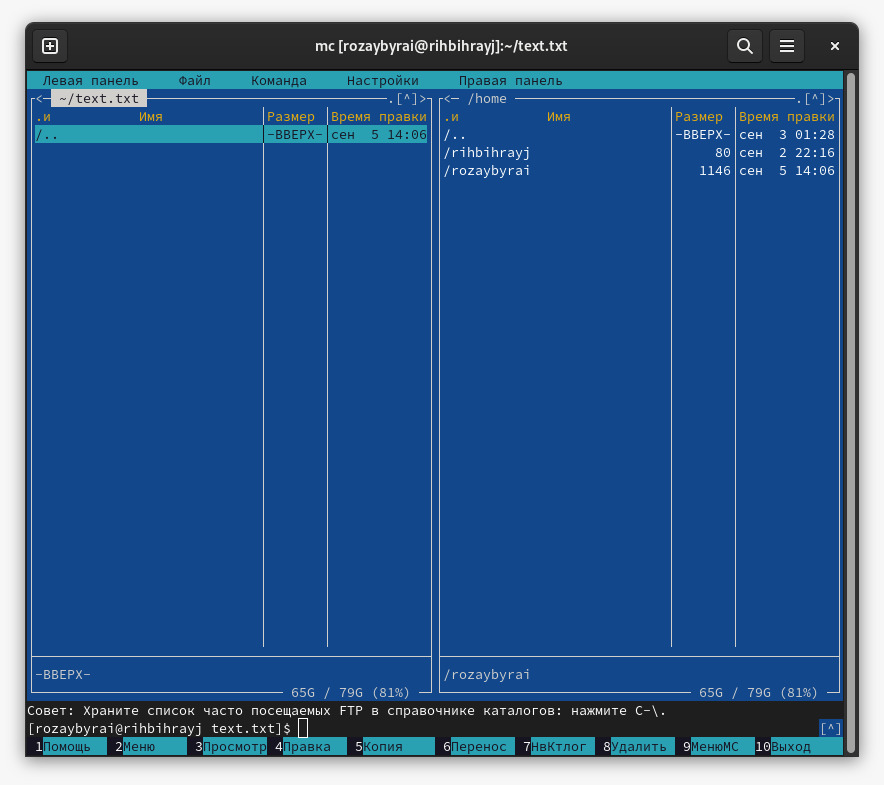

---
## Front matter
lang: ru-RU
title: Командная оболочка Midnight Commander
author: |
	Ыбырай Роза\inst{1}
institute: |
	\inst{1}RUDN University, Moscow, Russian Federation
	
date: 5 сентября, 2023, Москва

## Formatting
toc: false
slide_level: 2
theme: metropolis
header-includes: 
 - \metroset{progressbar=frametitle,sectionpage=progressbar,numbering=fraction}
 - '\makeatletter'
 - '\beamer@ignorenonframefalse'
 - '\makeatother'
aspectratio: 43
section-titles: true
---

# Цель работы

Освоение основных возможностей командной оболочки Midnight Commander. Приобретение навыков практической работы по просмотру каталогов и файлов; манипуляций
с ними.

# Задание

Изучить возможности midnight commander.

# Выполнение лабораторной работы
## Задание по mc

1. Изучение информаций о mc, вызвав в командной строке man mc

{ #fig:001 width=70% }

2. Запущение из командной строки mc, изучение его структуру и меню.

{ #fig:002 width=70% }

3. Выполнение нескольких операций в mc, используя управляющие клавиши (операции с панелями; выделение/отмена выделения файлов, копирование/перемещение файлов, получение информации о размере и правах доступа на файлы и/или каталоги и т.п.)

{ #fig:003 width=70% }

{ #fig:004 width=70% }

{ #fig:005 width=70% }

{ #fig:006 width=70% }

{ #fig:007 width=70% }

{ #fig:008 width=70% }

{ #fig:009 width=70% }

4. Выполнение основных команд меню левой и правой панели

{ #fig:010 width=70% }

{ #fig:011 width=70% }

{ #fig:012 width=70% }

{ #fig:013 width=70% }

{ #fig:014 width=70% }

5. Используя возможности подменю Файл , выполните:
	-  просмотр содержимого текстового файла;
	-  создание каталога;
	-  копирование в файлов в созданный каталог.

{ #fig:015 width=70% }
{ #fig:016 width=70% }
{ #fig:015 width=70% }

6. С помощью соответствующих средств подменю Команда осуществите:
	- поиск в файловой системе файла с заданными условиями (например, файла содержащего строку main);
	- выбор и повторение одной из предыдущих команд;
	- переход в домашний каталог;
	- анализ файла меню и файла расширений

{ #fig:015 width=70% }
{ #fig:019 width=70% }
{ #fig:020 width=70% }
{ #fig:021 width=70% }

7. Вызовить подменю Настройки . Освоить операции, определяющие структуру экрана mc
(Full screen, Double Width, Show Hidden Files и т.д.)

{ #fig:022 width=70% }
{ #fig:023 width=70% }

## Задание по встроенному редактору mc
1. Создать текстовой файл text.txt

{ #fig:024 width=70% }

2. Открыть этот файл с помощью встроенного в mc редактора.

{ #fig:025 width=70% }

# Выводы

В данной работе мы приобрели практические навыки по просмотру каталогов и файлов, манипуляций с ними.

## {.standout}

Wer's nicht glaubt, bezahlt einen Taler
