---
## Front matter
lang: ru-RU
title: Текстовой редактор vi
author: |
	Ыбырай Роза\inst{1}
institute: |
	\inst{1}RUDN University, Moscow, Russian Federation
date: 5 сентября, 2023, Москва

## Formatting
toc: false
slide_level: 2
theme: metropolis
header-includes: 
 - \metroset{progressbar=frametitle,sectionpage=progressbar,numbering=fraction}
 - '\makeatletter'
 - '\beamer@ignorenonframefalse'
 - '\makeatother'
aspectratio: 43
section-titles: true
---

# Цель работы

Познакомиться с операционной системой Linux. Получить практические навыки работы с редактором vi, установленным по умолчанию практически во всех дистрибутивах.

# Задание

Изучить редактор vi

# Выполнение лабораторной работы
## Создание нового файла с использованием vi

1. Создание нового каталога с именем ~/work/os/lab06.

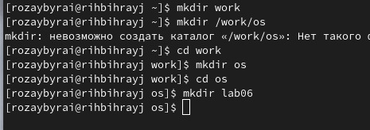{ #fig:001 width=70% }

2. Перейдите во вновь созданный каталог. Вызовите vi и создайте файл hello.sh

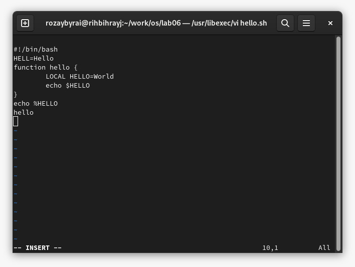{ #fig:002 width=70% }

3. Нажмите клавишу Esc для перехода в командный режим после завершения ввода
текста. Нажмите : для перехода в режим последней строки и внизу вашего экрана появится
приглашение в виде двоеточия.
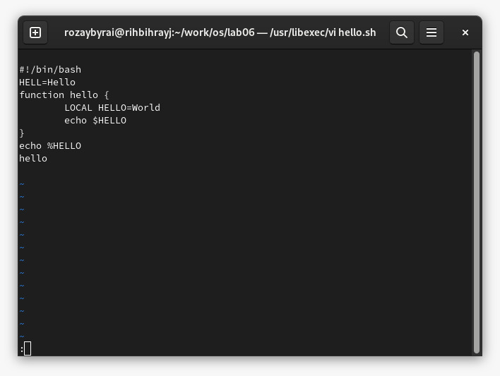{ #fig:003 width=70% }

4. Нажмите w (записать) и q (выйти), а затем нажмите клавишу Enter для сохранения
вашего текста и завершения работы.

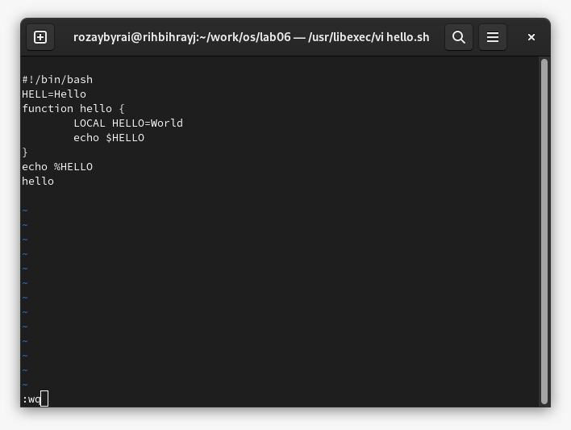{ #fig:004 width=70% }

5. Сделать файл исполняемым

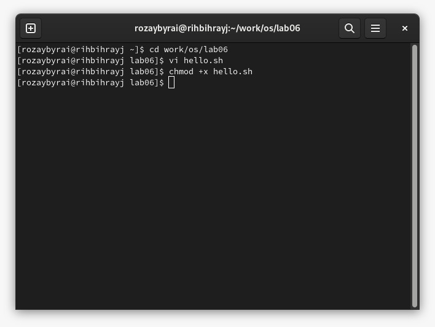{ #fig:005 width=70% }

## Редактирование существующего файла

1. Вызовите vi на редактирование файла. Установите курсор в конец слова HELL второй строки. Перейдите в режим вставки и замените на HELLO. Нажмите Esc для возврата в командный режим. Установите курсор на четвертую строку и сотрите слово LOCAL. 
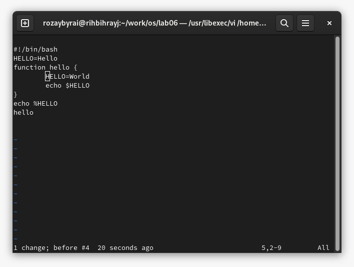{ #fig:006 width=70% }

2. Перейдите в режим вставки и наберите следующий текст: local, нажмите Esc для
возврата в командный режим. Установите курсор на последней строке файла. Вставьте после неё строку, содержащую следующий текст: echo $HELLO.
Нажмите Esc для перехода в командный режим.

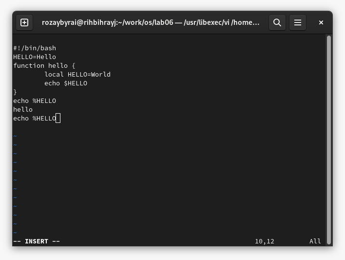{ #fig:007 width=70% }

3. Удаление последней строки

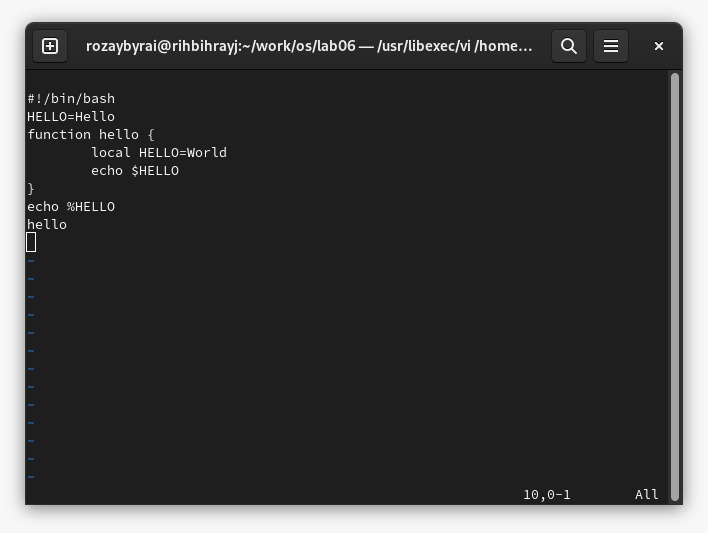{ #fig:008 width=70% }

4. Введение команды отмены изменений u для отмены последней команды

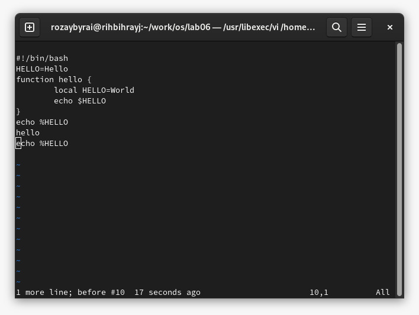{ #fig:009 width=70% }

5. Введите символ : для перехода в режим последней строки. Запишите произведённые изменения и выйдите из vi.

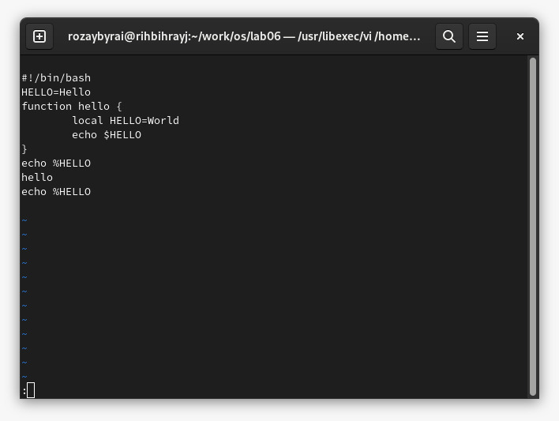{ #fig:010 width=70% }
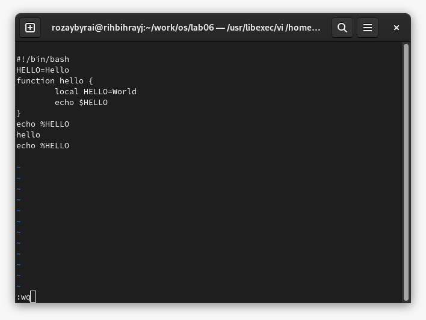{ #fig:011 width=70% }
# Выводы

Получили практические навыки работы с редактором vi

## {.standout}

Wer's nicht glaubt, bezahlt einen Taler
