---
## Front matter
title: "Текстовой редактор vi"
author: "Ыбырай Роза"

## Generic otions
lang: ru-RU
toc-title: "Содержание"

## Bibliography
bibliography: bib/cite.bib
csl: pandoc/csl/gost-r-7-0-5-2008-numeric.csl

## Pdf output format
toc: true # Table of contents
toc-depth: 2
lof: true # List of figures
lot: true # List of tables
fontsize: 12pt
linestretch: 1.5
papersize: a4
documentclass: scrreprt
## I18n polyglossia
polyglossia-lang:
  name: russian
  options:
	- spelling=modern
	- babelshorthands=true
polyglossia-otherlangs:
  name: english
## I18n babel
babel-lang: russian
babel-otherlangs: english
## Fonts
mainfont: PT Serif
romanfont: PT Serif
sansfont: PT Sans
monofont: PT Mono
mainfontoptions: Ligatures=TeX
romanfontoptions: Ligatures=TeX
sansfontoptions: Ligatures=TeX,Scale=MatchLowercase
monofontoptions: Scale=MatchLowercase,Scale=0.9
## Biblatex
biblatex: true
biblio-style: "gost-numeric"
biblatexoptions:
  - parentracker=true
  - backend=biber
  - hyperref=auto
  - language=auto
  - autolang=other*
  - citestyle=gost-numeric
## Pandoc-crossref LaTeX customization
figureTitle: "Рис."
tableTitle: "Таблица"
listingTitle: "Листинг"
lofTitle: "Список иллюстраций"
lotTitle: "Список таблиц"
lolTitle: "Листинги"
## Misc options
indent: true
header-includes:
  - \usepackage{indentfirst}
  - \usepackage{float} # keep figures where there are in the text
  - \floatplacement{figure}{H} # keep figures where there are in the text
---

# Цель работы

Познакомиться с операционной системой Linux. Получить практические навыки работы с редактором vi, установленным по умолчанию практически во всех дистрибутивах.

# Задание

Изучить редактор vi

# Выполнение лабораторной работы
## Создание нового файла с использованием vi

1. Создание нового каталога с именем ~/work/os/lab06.

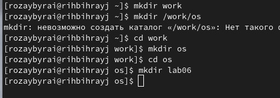{ #fig:001 width=70% }

2. Перейдите во вновь созданный каталог. Вызовите vi и создайте файл hello.sh

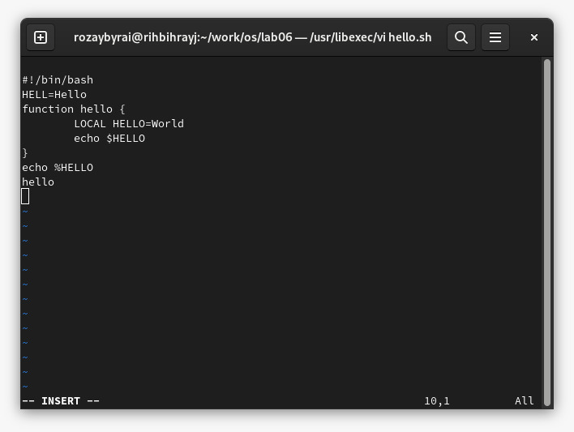{ #fig:002 width=70% }

3. Нажмите клавишу Esc для перехода в командный режим после завершения ввода
текста. Нажмите : для перехода в режим последней строки и внизу вашего экрана появится
приглашение в виде двоеточия.
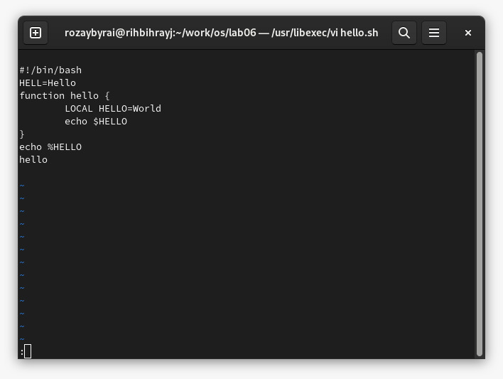{ #fig:003 width=70% }

4. Нажмите w (записать) и q (выйти), а затем нажмите клавишу Enter для сохранения
вашего текста и завершения работы.

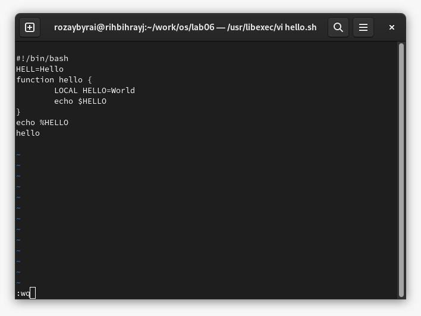{ #fig:004 width=70% }

5. Сделать файл исполняемым

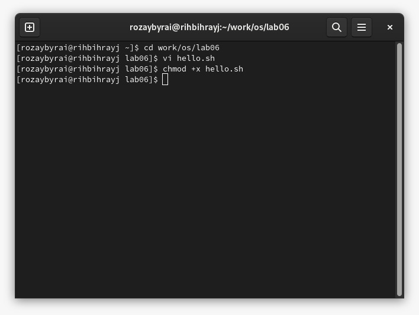{ #fig:005 width=70% }

## Редактирование существующего файла

1. Вызовите vi на редактирование файла. Установите курсор в конец слова HELL второй строки. Перейдите в режим вставки и замените на HELLO. Нажмите Esc для возврата в командный режим. Установите курсор на четвертую строку и сотрите слово LOCAL. 
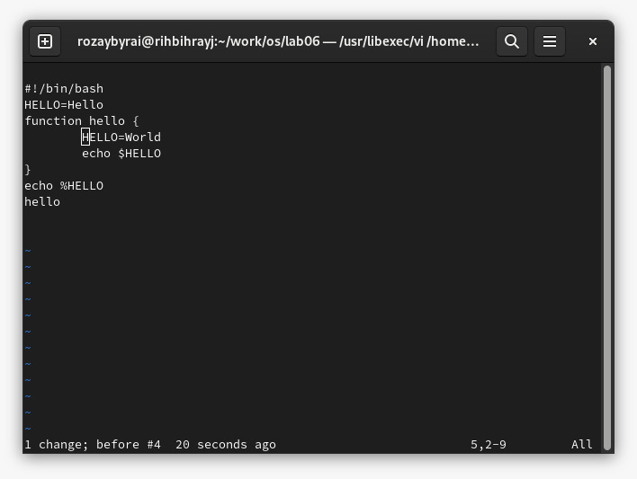{ #fig:006 width=70% }

2. Перейдите в режим вставки и наберите следующий текст: local, нажмите Esc для
возврата в командный режим. Установите курсор на последней строке файла. Вставьте после неё строку, содержащую следующий текст: echo $HELLO.
Нажмите Esc для перехода в командный режим.

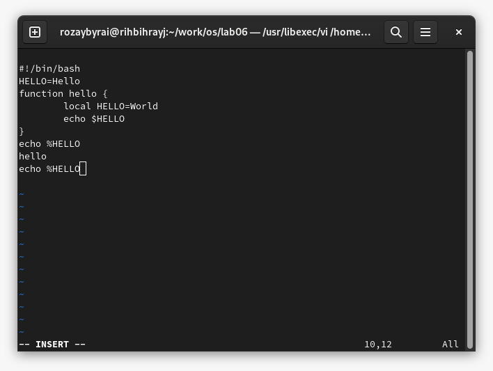{ #fig:007 width=70% }

3. Удаление последней строки

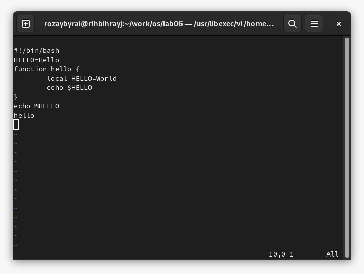{ #fig:008 width=70% }

4. Введение команды отмены изменений u для отмены последней команды

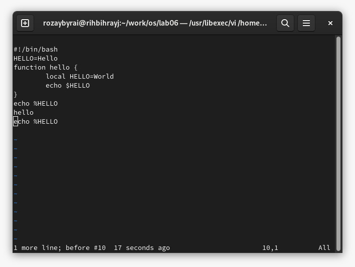{ #fig:009 width=70% }

5. Введите символ : для перехода в режим последней строки. Запишите произведённые изменения и выйдите из vi.

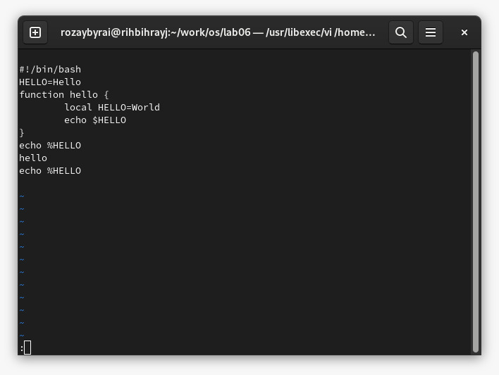{ #fig:010 width=70% }
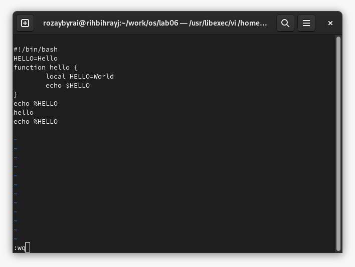{ #fig:011 width=70% }
# Выводы

Получили практические навыки работы с редактором vi

:::
