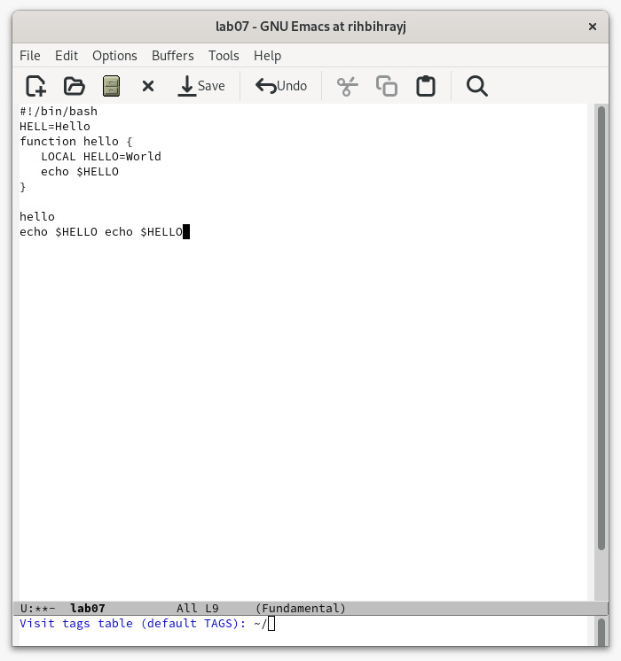

---
## Front matter
lang: ru-RU
title: Текстовой редактор emacs
author: |
	Anton L. Sevastianov\inst{1}
	
institute: |
	\inst{1}RUDN University, Moscow, Russian Federation

date: 5 сентября, 2023, Москва

## Formatting
toc: false
slide_level: 2
theme: metropolis
header-includes: 
 - \metroset{progressbar=frametitle,sectionpage=progressbar,numbering=fraction}
 - '\makeatletter'
 - '\beamer@ignorenonframefalse'
 - '\makeatother'
aspectratio: 43
section-titles: true
---

# Цель работы

Познакомиться с операционной системой Linux. Получить практические навыки работы с редактором Emacs.

# Задание

Научиться работать с редактором emacs.

# Выполнение лабораторной работы
## Основные команды emacs
1. Открывание emacs

{ #fig:001 width=70% }

2. Создавание файла

{ #fig:002 width=70% }

3. Написать текст в файл

{ #fig:003 width=70% }

4. Сохранение файла
   
{ #fig:004 width=70% }

5. Проделать с текстом стандартные процедуры редактирования, каждое действие должно осуществляться комбинацией клавиш.
	- Вырезать одной командой целую строку (С-k).
	- Вставить эту строку в конец файла (C-y).
	- Выделить область текста (C-space).
	- Скопировать область в буфер обмена (M-w).
	- Вставить область в конец файла.
	- Вновь выделить эту область и на этот раз вырезать её (C-w).
	- Отмените последнее действие (C-/).
   	- Научитесь использовать команды по перемещению курсора.
	- Переместите курсор в начало строки (C-a).
	- Переместите курсор в конец строки (C-e).
	- Переместите курсор в начало буфера (M-<).
	- Переместите курсор в конец буфера (M->).

{ #fig:005 width=70% }

{ #fig:006 width=70% }

{ #fig:007 width=70% }

{ #fig:008 width=70% }

6. Вывести список активных буферов на экран (C-x C-b).Переместитесь во вновь открытое окно (C-x) o со списком открытых буферов
и переключитесь на другой буфер. Закройте это окно (C-x 0). Теперь вновь переключайтесь между буферами, но уже без вывода их списка наэкран (C-x b).

{ #fig:009 width=70% }

{ #fig:010 width=70% }

{ #fig:011 width=70% }

{ #fig:012 width=70% }

7. Поделить фрейм на 4 части: разделите фрейм на два окна по вертикали (C-x 3), а затем каждое из этих окон на две части по горизонтали (C-x 2) 

{ #fig:013 width=70% }

8. В каждом из четырёх созданных окон открыть новый буфер (файл) и ввести несколько строк текста.

{ #fig:014 width=70% }

9. Переключитесь в режим поиска (C-s) и найдите несколько слов, присутствующих в тексте.

{ #fig:015 width=70% }

10. Переключайтесь между результатами поиска, нажимая C-s
    
{ #fig:016 width=70% }

11. Выйти из режима нажав на C-g.
    
# Выводы

В ходе данной лабораторной работы научились работать с текстовым редактором emacs.

## {.standout}

Wer's nicht glaubt, bezahlt einen Taler
