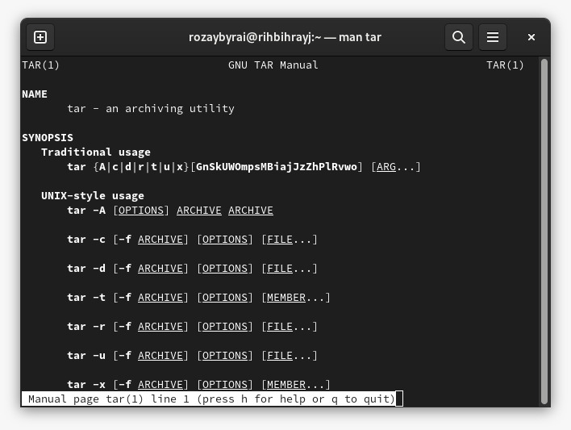
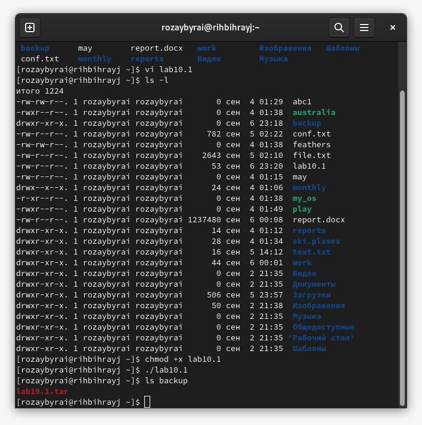
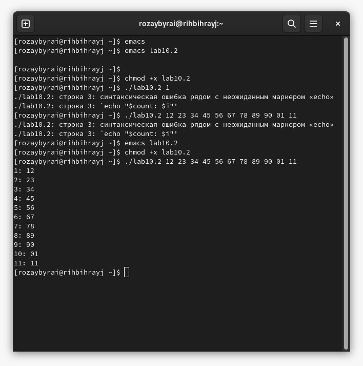
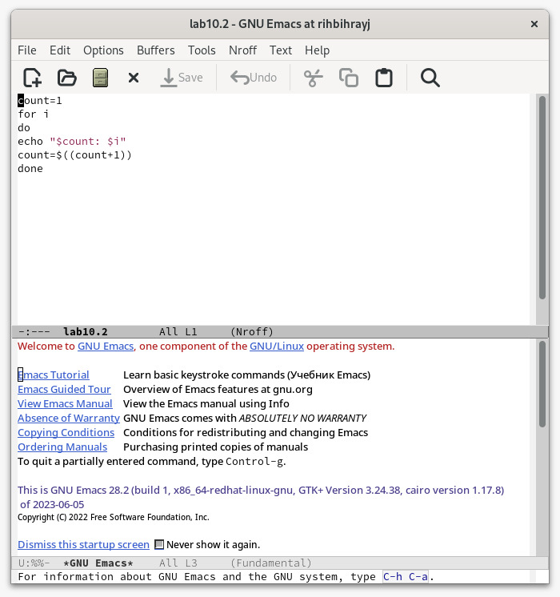
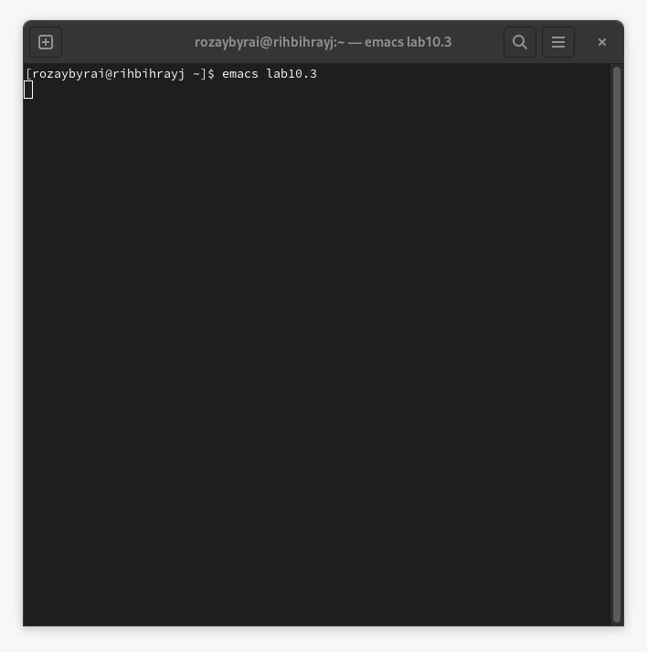
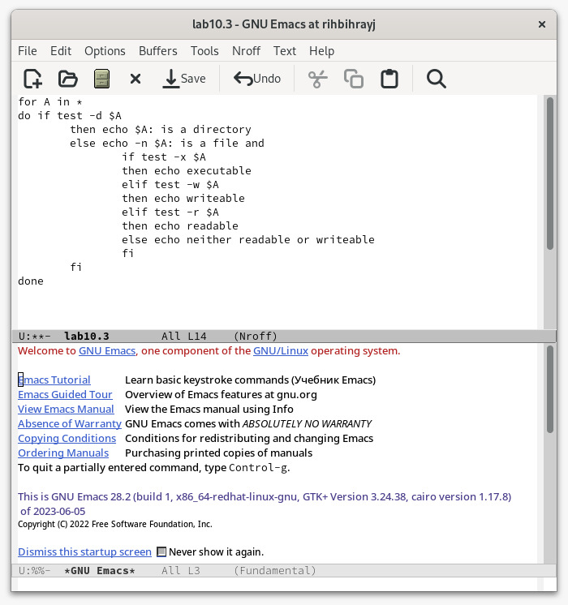
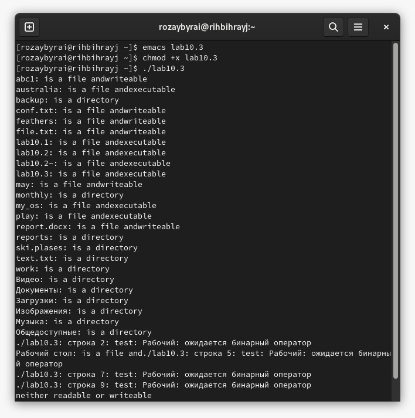
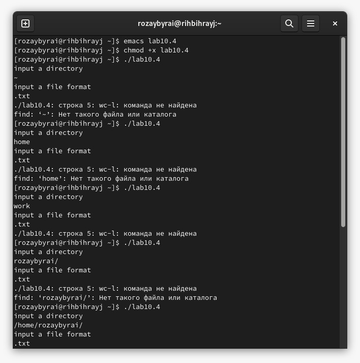
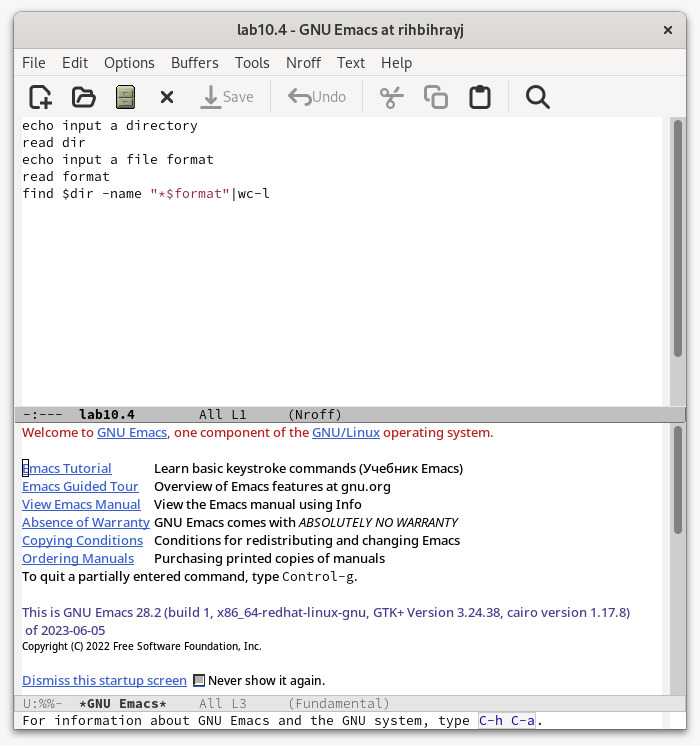

---
## Front matter
lang: ru-RU
title:  Programming in OS UNIX. Command files
author: |
	Ybyrai Roza\inst{1}
	
institute: |
	\inst{1}RUDN University, Moscow, Russian Federation
	
date: 7th september, 2023, Moscow

## Formatting
toc: false
slide_level: 2
theme: metropolis
header-includes: 
 - \metroset{progressbar=frametitle,sectionpage=progressbar,numbering=fraction}
 - '\makeatletter'
 - '\beamer@ignorenonframefalse'
 - '\makeatother'
aspectratio: 43
section-titles: true
---

# Цель работы

Изучить основы программирования в оболочке ОС UNIX/Linux. Научиться писать небольшие командные файлы.

# Задание

Выполнить 4 задания.

# Выполнение лабораторной работы
## Первое задание
Написать скрипт, который при запуске будет делать резервную копию самого себя (то есть файла, в котором содержится его исходный код) в другую директорию backup
в вашем домашнем каталоге. При этом файл должен архивироваться одним из архиваторов на выбор zip, bzip2 или tar. Способ использования команд архивации
необходимо узнать, изучив справку.

{ #fig:001 width=70% }

{ #fig:002 width=70% }

## Второе задание

Написать пример командного файла, обрабатывающего любое произвольное число аргументов командной строки, в том числе превышающее десять. Например, скрипт
может последовательно распечатывать значения всех переданных аргументов.

{ #fig:003 width=70% }

{ #fig:004 width=70% }

## Третье задание

Написать командный файл — аналог команды ls (без использования самой этой команды и команды dir). Требуется, чтобы он выдавал информацию о нужном каталоге
и выводил информацию о возможностях доступа к файлам этого каталога.

{ #fig:005 width=70% }

{ #fig:006 width=70% }

{ #fig:007 width=70% }

##  Четвертое задание

Написать командный файл, который получает в качестве аргумента командной строки
формат файла (.txt, .doc, .jpg, .pdf и т.д.) и вычисляет количество таких файлов
в указанной директории. Путь к директории также передаётся в виде аргумента командной строки.

{ #fig:008 width=70% }

{ #fig:009 width=70% }

# Выводы

В ходе данной лабораторной работы мы изучили основы программирования в оболочке ОС UNIX/Linux и научились писать небольшие командные файлы.

## {.standout}

Wer's nicht glaubt, bezahlt einen Taler
